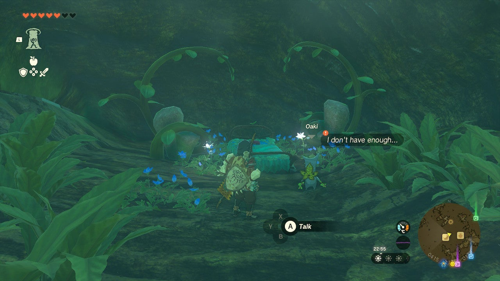
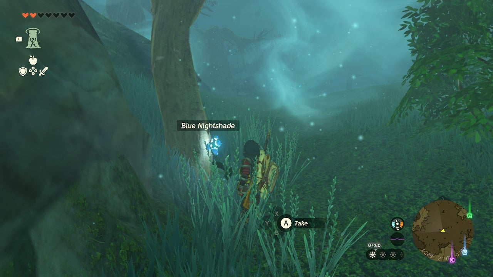
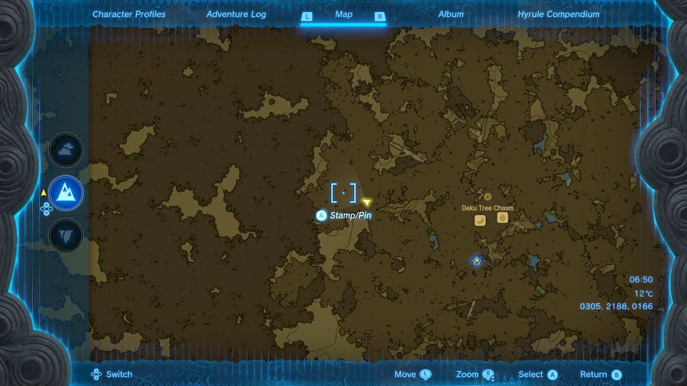

Did you find the Secret Room in the middle of the Korok Forest yet? Once you find a way to get through the Lost Woods in the Great Hyrule Forest region, you can access a hidden area to start a side quest: **The Secret Room**. This Tears of the Kingdom walkthrough will help you complete the quest. 

## The Secret Room Walkthrough

To start The Secret Room side quest, enter the large **Deku Tree** in the middle of the Lost Woods, next to the Musanokir Shrine. Next, use your Ascend ability to enter the secret room in the middle of the tree (coordinates 0417, 2176, 0179). 

Speak to Oaki, and he'll ask you for **four blue nightshades** and **two giant brightbloom seeds**. If you have them on hand, you can complete this quest right away. 

If not, you can find giant brightbloom seeds in nearby caves, such as the Pico Pond Cave, Lake Ferona Cave, and Lake Intenoch Cave. To see all cave locations, use our Tears of the Kingdom interactive map. 

As for blue nightshade, you're already in the best farming spot: the Lost Woods. The area around the Sakunbomar Shrine, as well as the path between this shrine and the Deku Tree, are amazing nightshade farming spots. If you haven't discovered this shrine yet, the path begins at coordinates 0305, 2188, 0166. 

**Return to Oaki** and hand him the materials. He'll ask you to stay until nightfall - if you agree, time will move forward automatically (no need for campfires). 

This will complete The Secret Room side quest. As a reward, you get a piece of **Korok Fabric**. 

The Secret Room

See the complete List of Side Quests and Side Adventures

### Up Next: Walkthrough

Previous

About IGN's Zelda TotK Guide Writers

Next

Walkthrough

### Top Guide Sections

  * Walkthrough
  * Zelda: Tears of The Kingdom Switch 2 Edition Guide
  * Zelda Notes Voice Memories
  * List of Side Quests and Side Adventures

### Was this guide helpful?

Leave feedback

Go to comments