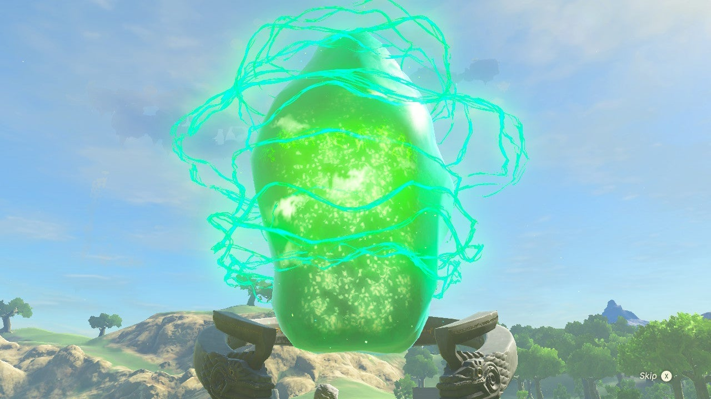
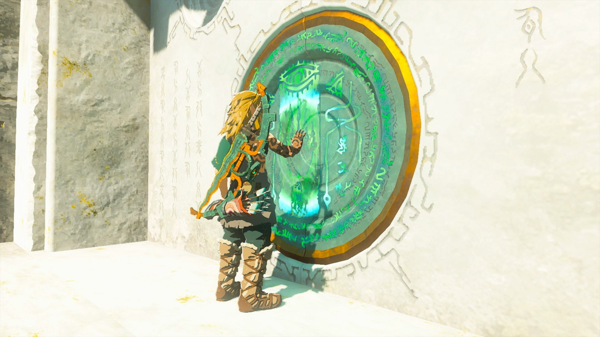

The Shrine Explorer is one of the many Side Quests in The Legend of Zelda: Tears of the Kingdom. It's the only Side Quests on The Great Sky Island and one of the few Side Quests/Side Adventures that begin and end on the sky islands above Hyrule in TotK. 

You are rewarded for completing all the Shrines in the game with this Side Quest. 

  * **Side Adventure Location:** The Great Sky Island - Behind the Goddess Statue in the Temple of Time.
  * **Prerequisites:** Complete all 152 Shrines in Totk.
  * **Rewards:** Ancient Hero's Aspect Armor

## How to Complete The Shrine Explorer

There are **152 total Shrines** in Tears of the Kingdom. 120 Shrines on Hyrule's surface and 30 in Sky Hyrule. 

After completing your last Shrine, the Shine Explorer Side Quest will become available. 

It's a simple quest; just return to the **Temple of Time** on the **Great Sky Island** in Central Hyrule Sky and open the treasure chest behind the Goddess Statue. The chest will contain the **Ancient Hero's Aspect Armor**. This armor will make Link look like one of the ancient Zonai people, offering amazing defensive stats for Link. 

The Shrine Explorer

For more on The Legend of Zelda: Tears of the Kingdom, check out our other guides: 

  * Link's Abilities
  * Region Guides and Important Locations
  * Materials and Resources List
  * All Recipes and Cookbook Guide
  * Labyrinth Shrines and Solutions

### Up Next: Walkthrough

Previous

About IGN's Zelda TotK Guide Writers

Next

Walkthrough

### Top Guide Sections

  * Walkthrough
  * Zelda: Tears of The Kingdom Switch 2 Edition Guide
  * Zelda Notes Voice Memories
  * List of Side Quests and Side Adventures

### Was this guide helpful?

Leave feedback

Go to comments