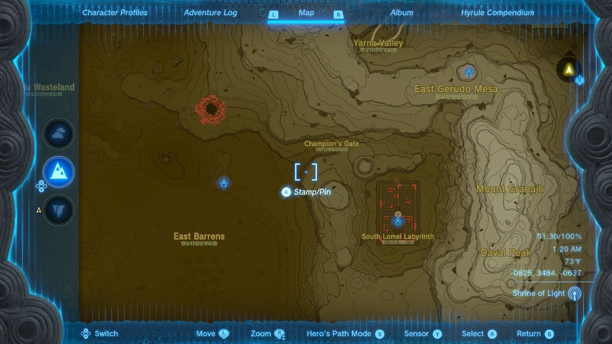
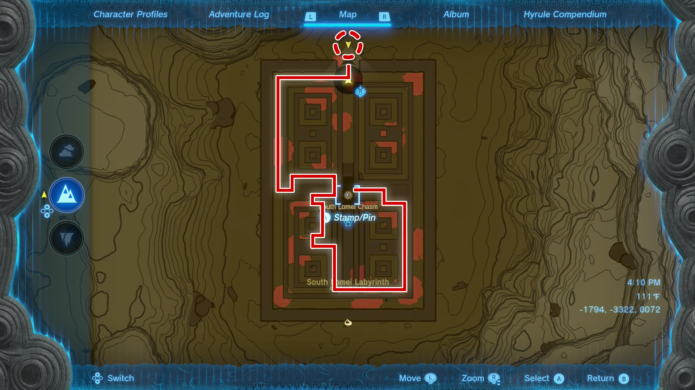
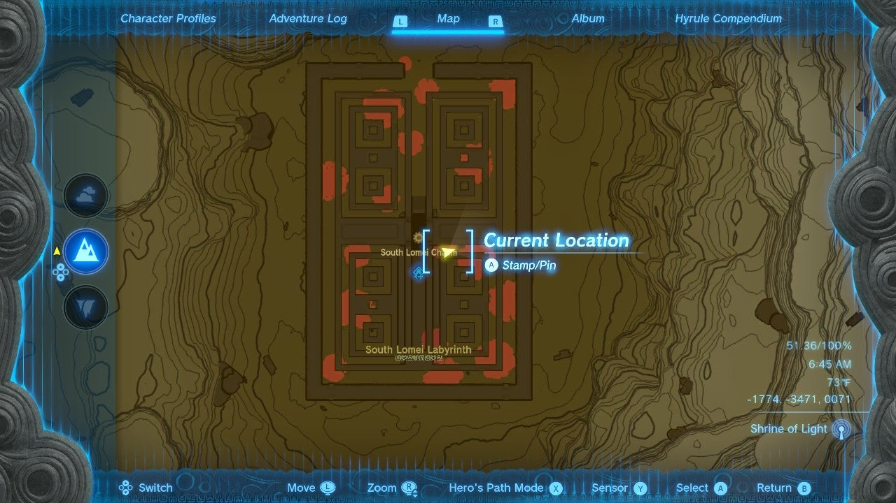
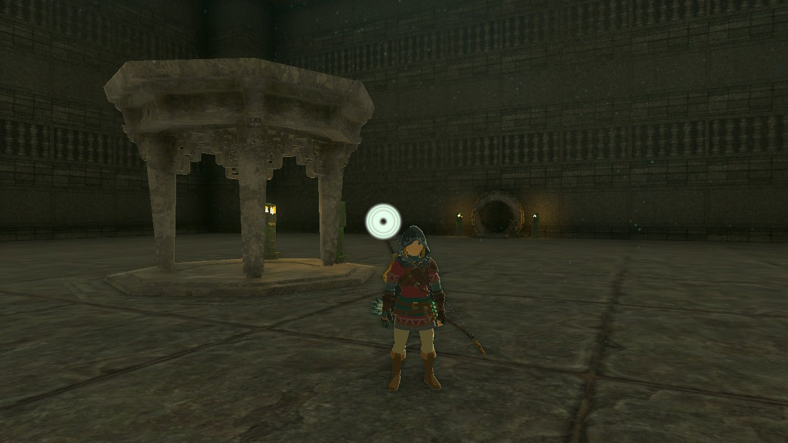
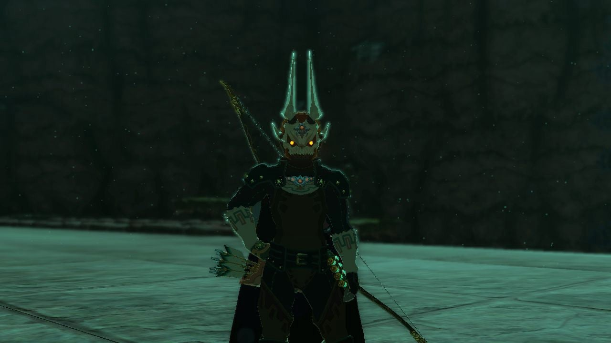
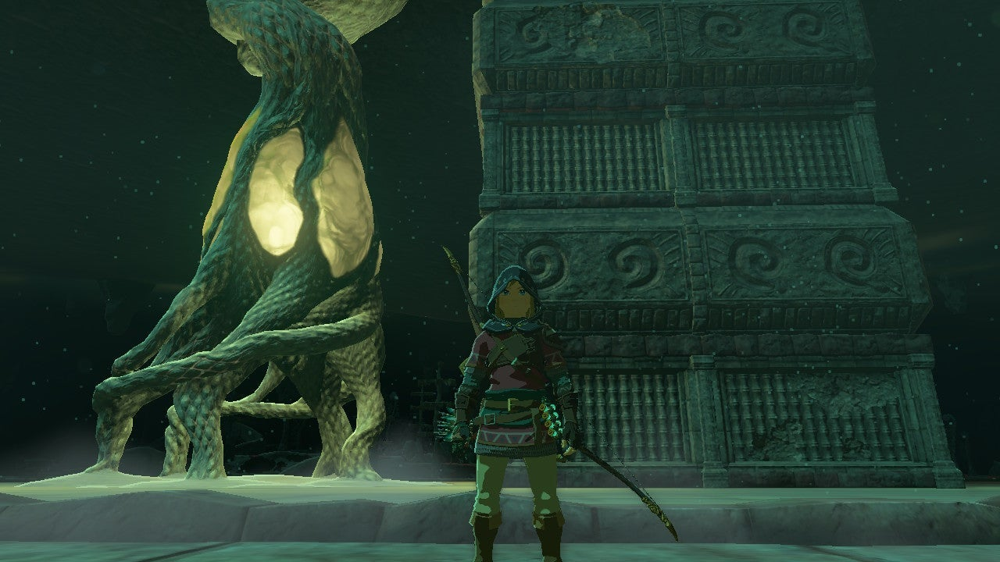

South Lomei Labyrinth is one of three labyrinths in The Legend of Zelda: Tears of the Kingdom. This page will help you get to the shrines in both the South Lomei Labyrinth and the sky labyrinth directly above it. Labyrinths in Tears of the Kingdom have three different parts that must be completed in the following order: Surface, Sky, Depths. Completing all three will reward you with a special piece of armor. 

## South Lomei Labyrinth Location

The South Lomei Labyrinth is located in the Gerudo region toward the southwest of the map, on the eastern side of the Gerudo Desert. 

## South Lomei Labyrinth Shrine Solution

There are a couple of different ways to get to the shrine at the center of this much smaller labyrinth, depending on how you want to go about it. The simplest solution is to start at the entrance in the north and follow a path of acorns that a Zonai Research team NPC has left leading to the end. 

**Having trouble following the trail?** If you’ve unlocked the improved tracker on your Purah Pad, you can take a picture of the item you are following and then set it to be tracked so that you always have an indication as to where the next closest one is waiting.

However, following that path is far from the most direct route. The Ascend ability, a rocket strapped to your shield, or a fire with a pine cone thrown into it will allow you to quickly get on top of the labyrinth walls, and from there you can explore the area more safely and quickly. 

The fastest way to bypass the maze entirely is to get on top of the walls, then run to a spot just south of the eastern solid section in the center (shown below). Drop down and you will find a path with acorns leading in toward the central chamber, where you can activate the shrine. 

The Motsusis Shrine doesn’t have a challenge inside it, so you can easily enter, take the treasure chest, and collect your Blessing of Light. Make sure you also activate the Zonai panel in the room with the shrine in order to unlock the Sky Labyrinth directly above it. 

**Don’t forget the loot!** There are treasure chests with powerful weapons hidden throughout, usually with one hiding in each quarter of this labyrinth. The best way to find them is to track chests with the upgraded Purah Pad, which will lead you toward each one.

## Unlock the South Lomei Castle Top Floor

Once you’ve completed the Labyrinth on the surface, the one in the sky above it will open up and have a shrine waiting for you as well. The quickest way to reach the entrance on the north side is to use the Gerudo Canyon Skyview Tower and glide to the nearby East Gerudo Sky Archipelago. 

From their you can build a flying machine out of a Zonai wing glider and a few fans to fly south. You’ll able to complete the Siyamotsus Shrine outside its entrance at this point, as well as activate the Zonai panel in order to enter a labyrinth with no floor to it. 

## Completing the South Lomei Castle Top Floor Labyrinth

The best way to get through this maze is hover with your paraglider while using your map as a guide. While this might seem intimidating, low gravity and strong wind keeps you in the air for substantially longer than usual. There are also plenty of platforms to land on and refill your stamina along the way. Make your way to each of the four panels you need to activate, which should be marked on your map as part of the labyrinth’s side quest. 

Once you have done so, the wind will start to blow harder, allowing you to fly above the walls of the labyrinth and to one final panel near the center. Activating that will unluck a chasm down in the surface maze, letting you dive off this upper one, all the way down, and straight into the depths for one final labyrinth challenge. 

## Completing the South Lomei Depths Labyrinth

While it’s called a Labyrinth, this final area isn’t actually much of a maze. There are some chests with powerful weapons hiding in the corners to find, but ultimately you just throw out some Brightbloom seeds to help find your way to a nearby central chamber with a Flux Construct III waiting to be defeated. 

Once you take it down, activate one final panel and you’ll be rewarded with a chest containing a piece of the Evil Spirit Armor Set: the Evil Spirit Mask, which gives you a stealth boost and mimics the look of Phantom Ganon from Ocarina of Time. The other two pieces can be found in the same way, but at the North Lomei Labyrinth to the north and the Lomei Labyrinth Island to the northeast. 

That’s it! But before you leave, don’t forget to exit the labyrinth out its roof passage and activate a Lightroot hiding on the north side of it behind the central shaft you came down. There are also treasure chests hiding near the surface on both the east and west outside faces of the structure. 

The South Lomei Prophecy

See the complete List of Side Quests and Side Adventures

### Up Next: Satori Tree Locations and Map (Cherry Blossom Trees)

Previous

Lomei Labyrinth Island

Next

Satori Tree Locations and Map (Cherry Blossom Trees)

### Top Guide Sections

  * Walkthrough
  * Zelda: Tears of The Kingdom Switch 2 Edition Guide
  * Zelda Notes Voice Memories
  * List of Side Quests and Side Adventures

### Was this guide helpful?

Leave feedback

Go to comments