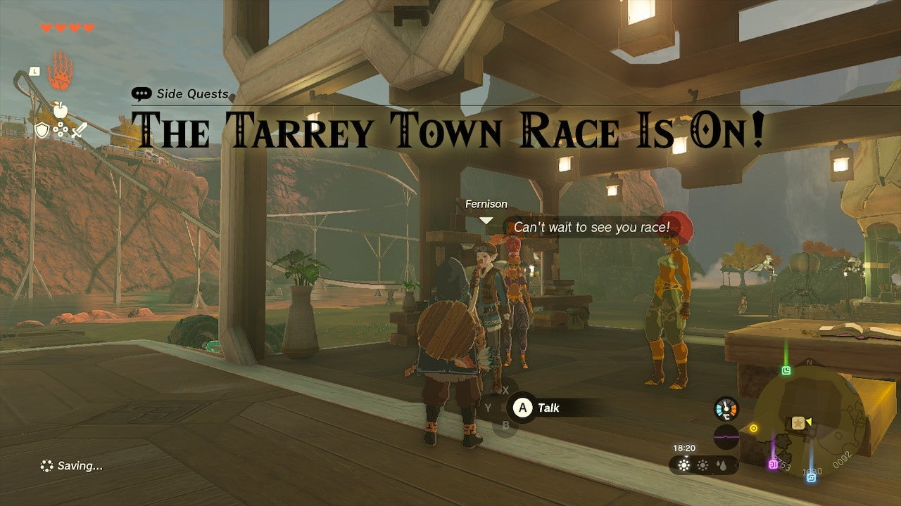
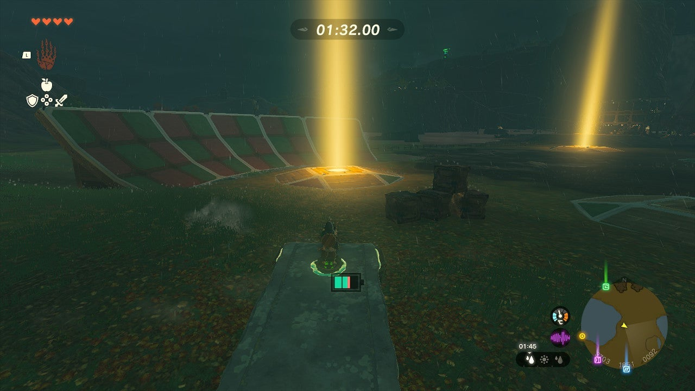

Up for another Tarrey Town race? The **Tarrey Town Race Is On!** side quest becomes available after you've completed Master the Vehicle Prototype in the Akkala Highlands. Your car-building expertise and racing skills are once again required. 

Here's how to complete The Tarrey Town Race Is On! 

## The Tarrey Town Race Is On Walkthrough

To start this side quest, travel to the Akkala region and go to the area west of Tarrey Town, where you'll find the Tarrey Town Race building. It's the same location as the previous side quest, Master the Vehicle Prototype (coordinates 3753, 1675, 0092). 

Note that you can't start the Tarrey Town Race immediately after completing the Vehicle Prototype quest - you need to **wait roughly a day** before it becomes available. Once you've returned, speak to Fernison again to start the quest. 

The first objective is to **build your own racing vehicle**. Any design is allowed, as long as you use a steering stick from Fernison (find it on the table near her). There are plenty of vehicle parts nearby, including a rocket (great for an extra speed boost), but a standard four-wheel design should be more than enough to win this race. 

Once you've placed the **steering stick** on your vehicle, you can start the race. The rules are the same as before: drive across the **illuminated tiles** within the time limit (two minutes) and don't let go of the steering stick before reaching the finish line. 

Once you've completed the race, Fernison will congratulate you and ask you to come back at a later time for the next side quest. 

The Tarrey Town Race Is On!

See the complete List of Side Quests and Side Adventures

### Up Next: Walkthrough

Previous

About IGN's Zelda TotK Guide Writers

Next

Walkthrough

### Top Guide Sections

  * Walkthrough
  * Zelda: Tears of The Kingdom Switch 2 Edition Guide
  * Zelda Notes Voice Memories
  * List of Side Quests and Side Adventures

### Was this guide helpful?

Leave feedback

Go to comments