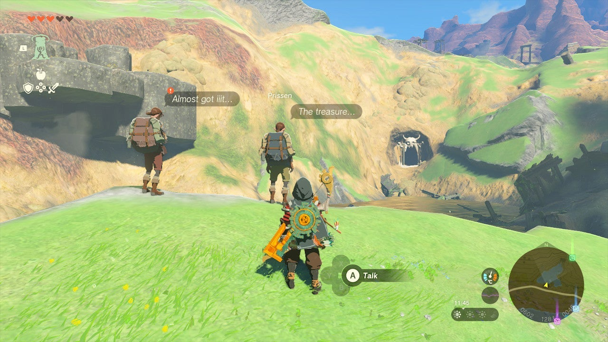
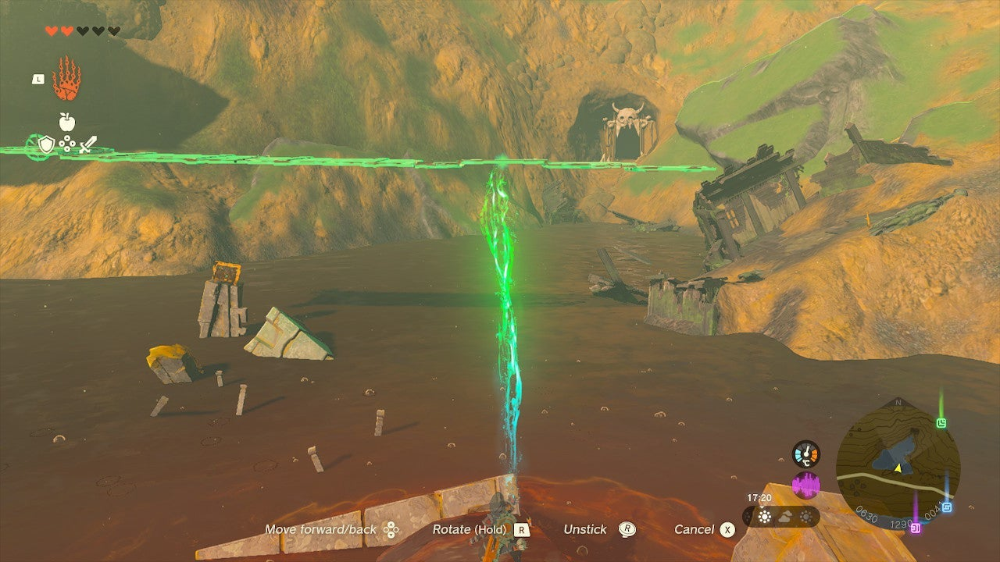

If you fancy another Hyrule treasure hunt, The Treasure Hunters side quest in the Great Hyrule Forest region is exactly what you're looking for. All it takes is some creative construction work. 

Here's how to complete **The Treasure Hunters** in The Legend of Zelda: Tears of the Kingdom. 

## The Treasure Hunters Walkthrough

To start this side quest, travel the road south of the Great Hyrule Forest, leading from Helmhead Bridge to the Woodland Stable. Next to their camp at the small lake, at coordinates 0600, 1280, 0047, you'll find **Domidak**. Speak to him to begin The Treasure Hunters. 

Domidak is trying to get his hands on the treasure chest in the middle of the lake, but as the water is deadly, he can't reach it. Use your Ultrahand ability on the nearby planks to create a bridge leading to the chest. Be careful not to knock down the chest though! 

Collect the treasure and return to Domidak to complete The Treasure Hunters. The only reward for this quest are the contents of the chest: **three Bomb Flowers**. 

The Treasure Hunters

See the complete List of Side Quests and Side Adventures

### Up Next: Walkthrough

Previous

About IGN's Zelda TotK Guide Writers

Next

Walkthrough

### Top Guide Sections

  * Walkthrough
  * Zelda: Tears of The Kingdom Switch 2 Edition Guide
  * Zelda Notes Voice Memories
  * List of Side Quests and Side Adventures

### Was this guide helpful?

Leave feedback

Go to comments