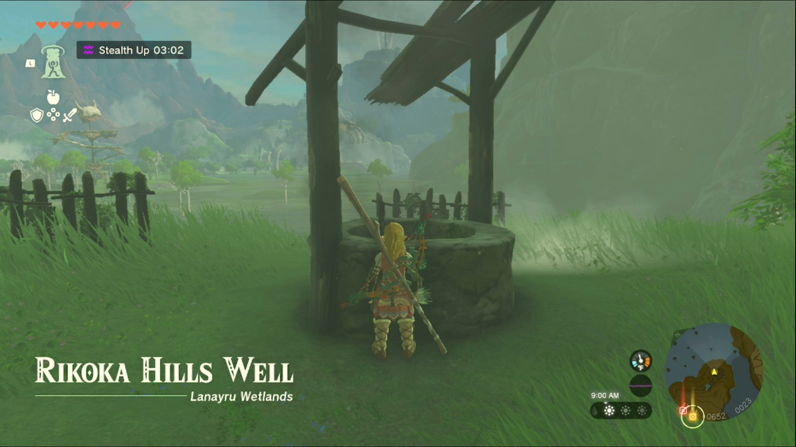
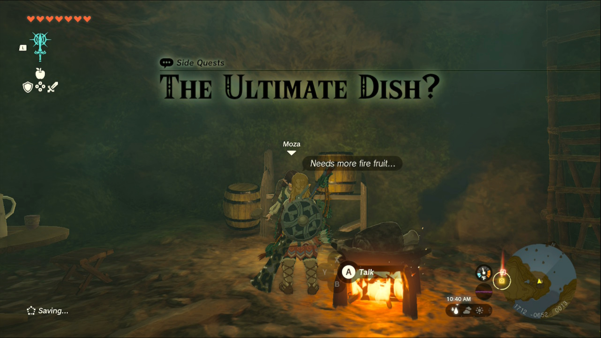
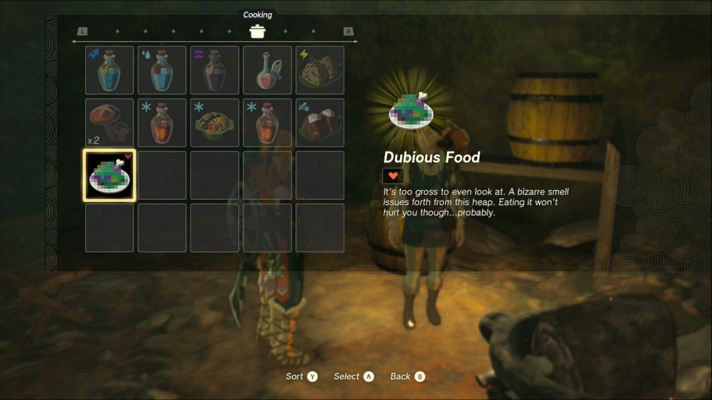
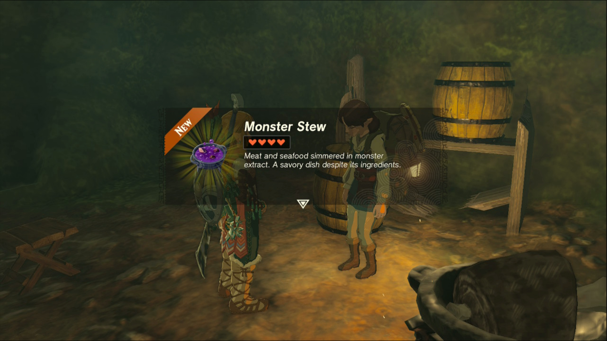

The Ultimate Dish? is one of the Side Quests you’ll discover in the Lanayru Wetlands. Side Quests are quests in The Legend of Zelda: Tears of the Kingdom that are relatively short or simple chores that can earn you small rewards or services. 

## The Ultimate Dish? Guide

To start the Side Quest “The Ultimate Dish?” you need to find the Rikoka Hills Well, north of Kakariko Village. It’s south of the Lanayru Wetlands as well, on a bit of land on the south shore. The exact coordinates are 0717, -0648, 0023. 

When you find the well, you’ll see smoke pouring out of it. Head inside to speak to Moza, the woman tending to a burning meal. She will task you with providing her with a ruined meal, whether it’s Dubious Food or Rock-Hard Food. 

These can be made by mixing any food with any monster item, such as a Bokoblin Claw or Moblin Tooth. Bring her the result and she’ll offer to ‘fix’ the meal for a small first-time fee of 5 rupees; future repairs will cost 10 rupees instead. 

Agreeing to pay will complete the quest, and you’ll receive a meal that actually grants health or other benefits. 

From here on out, you can bring her any ruined meals to fix them, although she hints at a merchant in the Akkala region that might allow you to fix your meals without her. 

The Ultimate Dish?

See the complete List of Side Quests and Side Adventures

### Up Next: Walkthrough

Previous

About IGN's Zelda TotK Guide Writers

Next

Walkthrough

### Top Guide Sections

  * Walkthrough
  * Zelda: Tears of The Kingdom Switch 2 Edition Guide
  * Zelda Notes Voice Memories
  * List of Side Quests and Side Adventures

### Was this guide helpful?

Leave feedback

### In This Guide

The Legend of Zelda: Tears of the KingdomNintendo EPD

Initial Release: May 12, 2023

Learn more

Go to comments