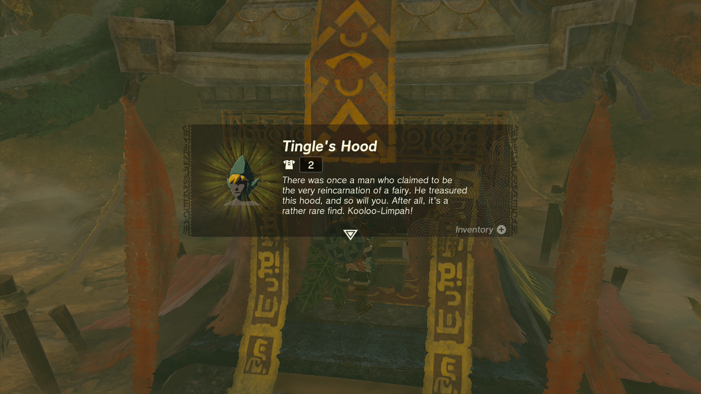
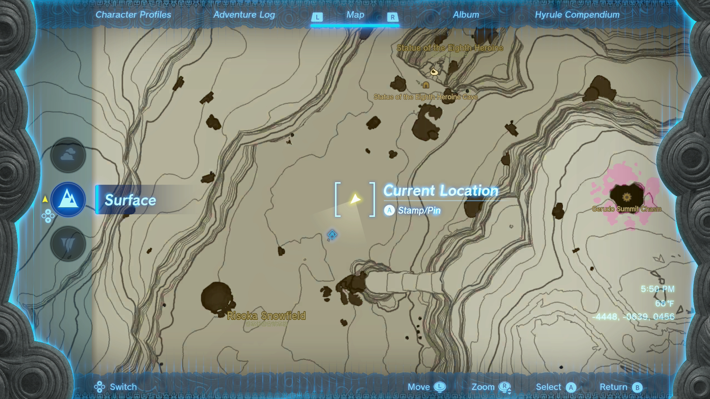
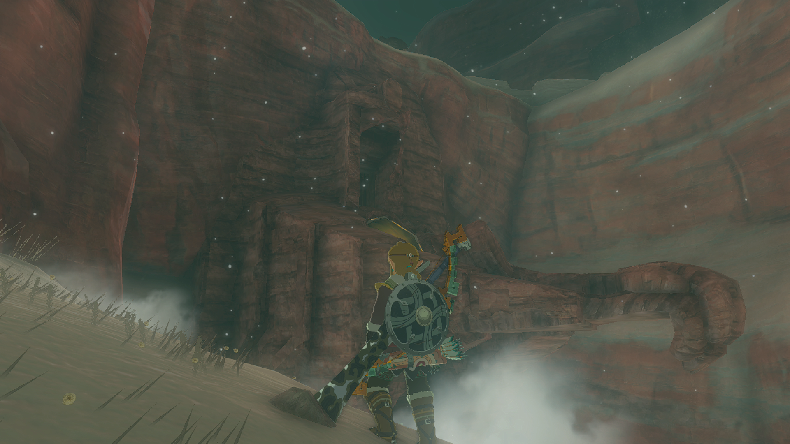
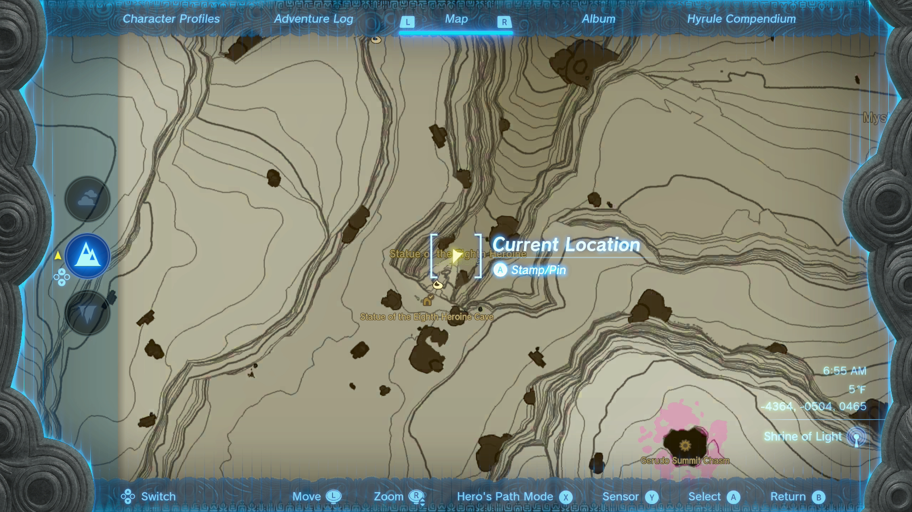
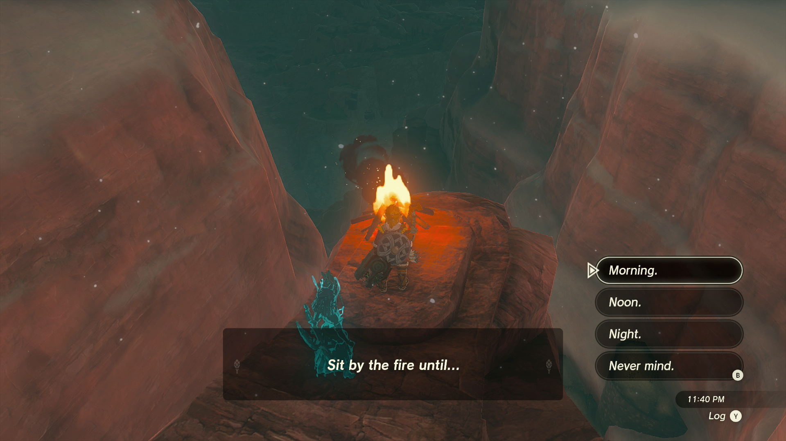
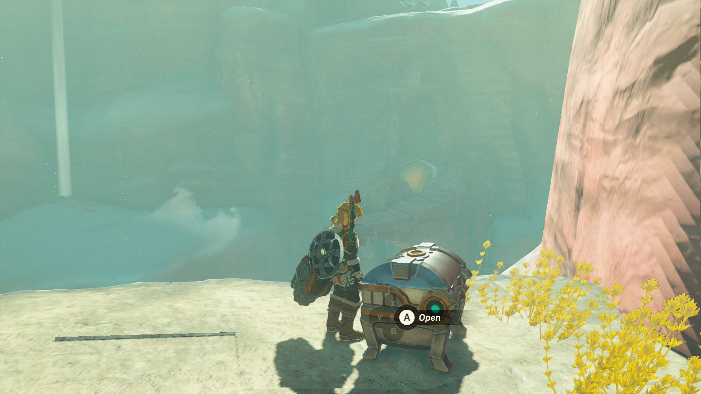
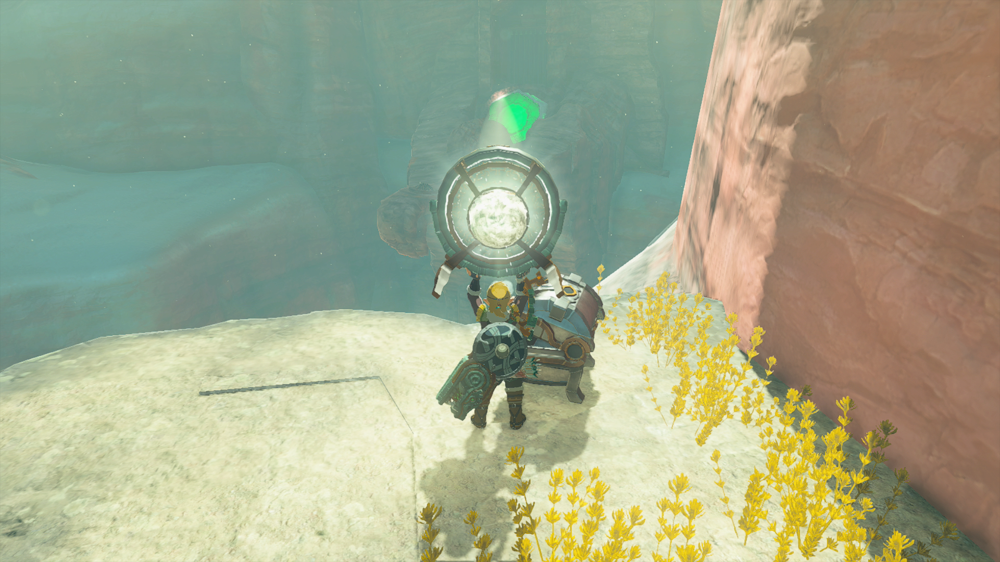
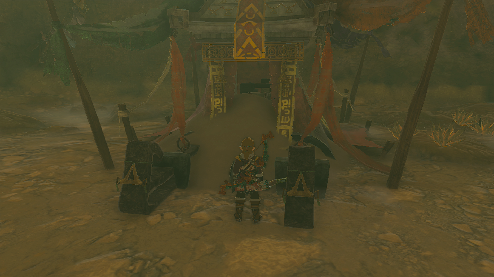
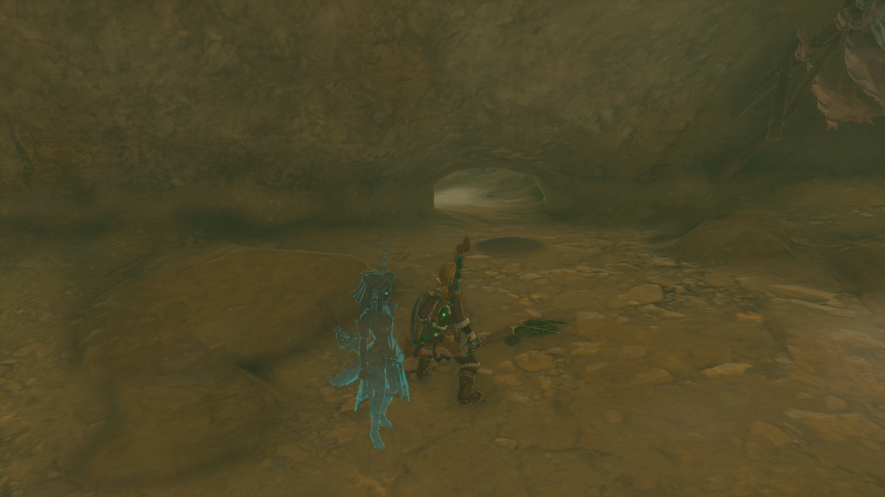

Tingle's Hood is a returning piece of Armor in The Legend of Zelda: Tears of the Kingdom, and though it was previously a Breath of the Wild DLC exclusive, this rare headgear can now be acquired by anyone that knows its location. Tingle's Hood is part of Tingle's Armor Set, and it cannot be upgraded or dyed. 

In this Tears of the Kingdom guide, you'll learn how to unlock Tingle's Hood and get details on this item's stats. 

## Tingle's Hood

  * **Description:** _"There was once a man who claimed to be the very reincarnation of a fairy. He treasured this hood, and so will you. After all, it's a rather rare find. Kooloo-Limpah!"_

Tingle's Hood Base Stats

Defense  
Effect Bonus  
Cost  
Sale Value

2  
N/A  
N/A  
600

Tingle's Hood

Though Tingle's Hood doesn't provide an individual Effect Bonus, if you wear Tingle's Hood, Shirt, and Tights together, you'll receive a **Night Speed Up Set Bonus**!

## Where to Find Tingle's Hood

  * **Tingle's Hood Coordinates:** -4448, -0639, 0456

Tingle's Hood can be found within the **Statue of the Eighth Heroine** , located just northwest of the Gerudo Summit in the Gerudo Highlands. To reach the Statue of the Eighth Heroine, fast-travel to the nearby **Otutsum Shrine** , then travel northward toward Hemaar's Descent. 

If you've yet to discover the Otutsum Shrine, launch from the Gerudo Highlands Skyview Tower before gliding northwest past the Gerudo Summit and the Gerudo Summit Chasm. 

  * **Statue of the Eight Heroine Coordinates:** -4364, -0504, 0465

When you reach the Statue of the Eight Heroine, you'll notice a large yellow panel on the statue's chest. To open the secret cave entrance, use a **Zonai Mirror** to deflect sunlight at the panel to power it up until it turns green. 

If it's nighttime when you arrive at the statue, build a quick campfire and sit by the fire until noon.

  * **Ledge Coordinates:** -4360, -0453, 0470

Once the sun is out, stand at the edge of the statue, then look for the small ledge just north of your location. Here, you'll discover a chest that houses **3x Zonai Mirrors**. Open your inventory to pull out a Mirror, then deflect the sunlight into the panel until it turns green. 

After the panel turns green and you reveal the secret cave entrance, head inside and defeat the small army of monsters within. Once the enemies have been dealt with, approach the altar at the back of the cave. 

Use the nearby Zonai Fan or a Korok-Frond Guster to clear the sand pile, and open the chest to get your hands on Tingle's Hood! 

Before leaving the cave, look east of the altar to find a sand pile that's blocking a secret passage. Again, use a Zonai Fan or a Korok-Frond Guster to clear the sand pile, then crouch through the small opening to find a Bubbulfrog! 

## Tingle's Hood Upgrades

Unfortunately, Tingle's Hood _**cannot**_ be dyed in Hateno Village or upgraded at Great Fairy Fountains. 

### Up Next: Walkthrough

Previous

About IGN's Zelda TotK Guide Writers

Next

Walkthrough

### Top Guide Sections

  * Walkthrough
  * Zelda: Tears of The Kingdom Switch 2 Edition Guide
  * Zelda Notes Voice Memories
  * List of Side Quests and Side Adventures

### Was this guide helpful?

Leave feedback

### In This Guide

The Legend of Zelda: Tears of the KingdomNintendo EPD

Initial Release: May 12, 2023

Learn more

Go to comments