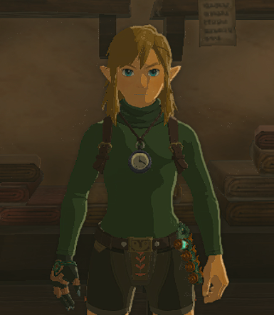
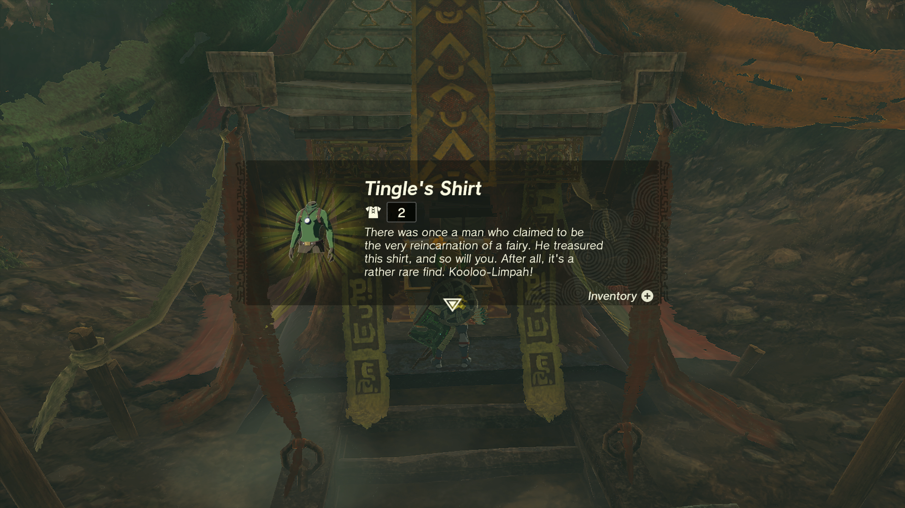
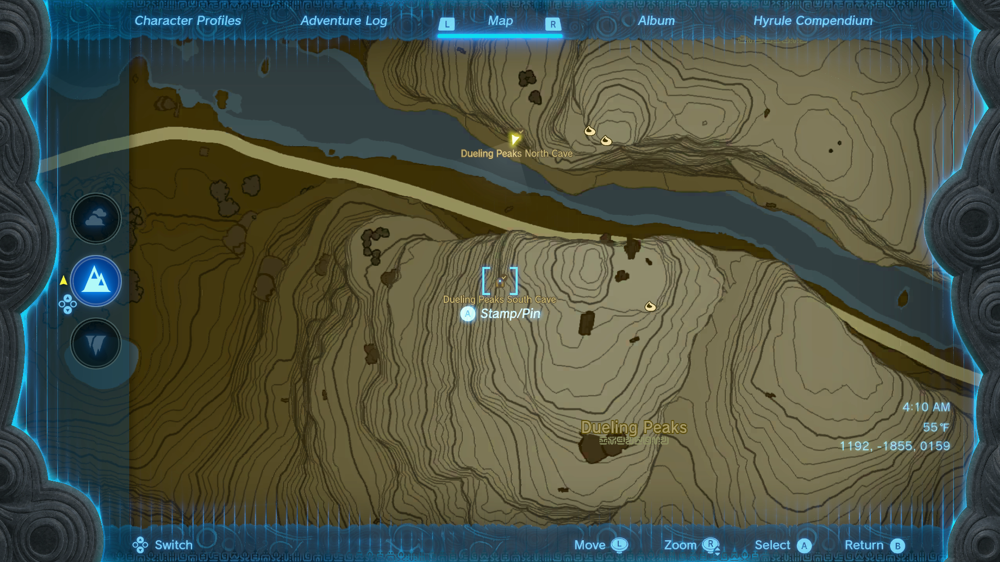
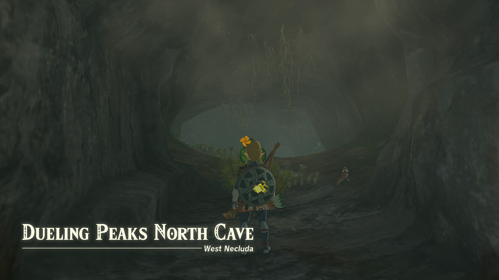
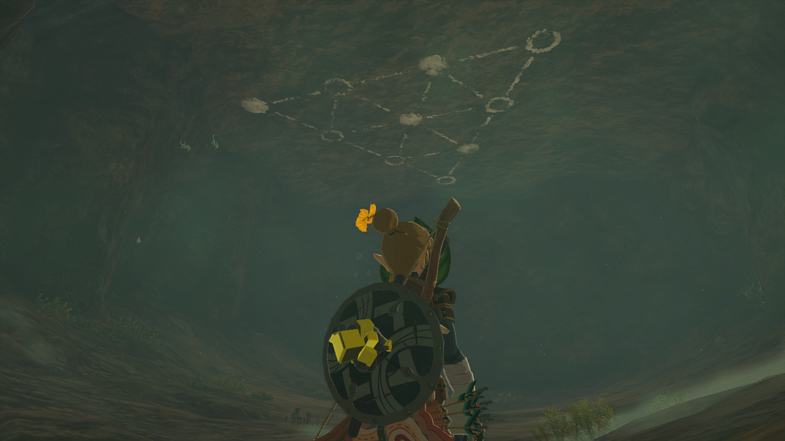
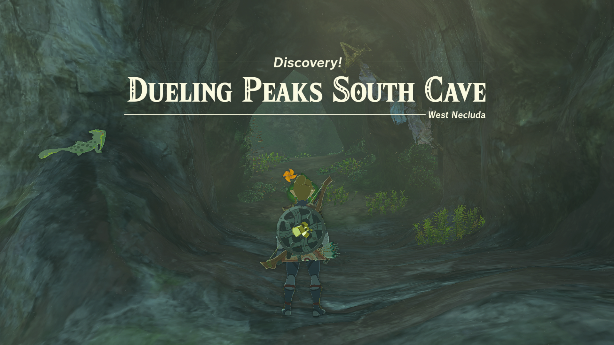
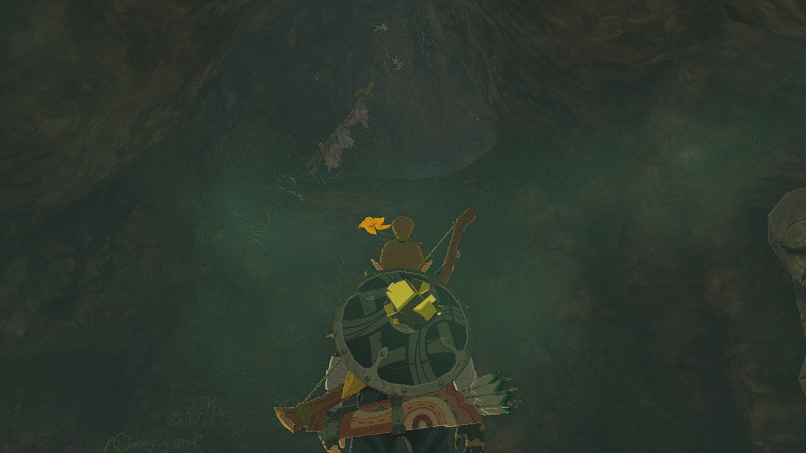
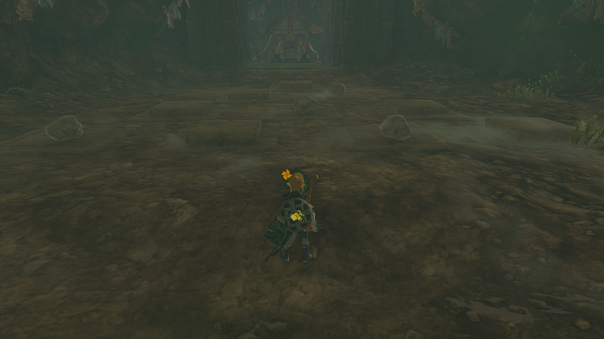

Tingle's Shirt is a returning piece of Armor in The Legend of Zelda: Tears of the Kingdom. While previously a DLC exclusive it is now available to anyone with a sharp eye and some puzzle-solving. Tingle's Shirt is part of Tingle's Armor Set, and it cannot be upgraded or dyed. 

In this Tears of the Kingdom guide, you'll learn how to unlock Tingle's Hood and get details on this item's stats. 

## Tingle's Shirt

  * **Description:** _"There was once a man who claimed to be the very reincarnation of a fairy. He treasured this shirt, and so will you. After all, it's a rather rare find. Kooloo-Limpah!_ "

Tingle's Shirt Base Stats

Defense  
Effect Bonus  
Cost  
Sale Value

2  
N/A  
N/A  
600

Tingle's Shirt

Though Tingle's Shirt doesn't provide an individual Effect Bonus, if you wear Tingle's Hood, Shirt, and Tights together, you'll receive a **Night Speed Up Set Bonus**!

## Where to Find Tingle's Shirt

Ready up your stamina to glide or climb as the path to Tingle's Shirt involves two caves on the sides of the mountains that make up Dueling Peaks. Start in the Dueling Peaks North Cave found on the face of the north mountain between the two peaks. 

  * **Dueling Peaks North Cave Coordinates:** 1192, -1855, 0159

Upon entering the cave you will face a few Horriblin before continuing to the second chamber. Make note of the triangle shape etched here on the ceiling, particularly of the position of the filled circles. 

Continue to the Dueling Peaks South Cave found on the opposite mountain face. It is higher up the mountain than the North Cave and sits on a similar type of ledge. 

  * **Dueling Peaks South Cave Coordinates:** 1182, -1948, 0246

Be prepared for a Like Like on the wall just inside the entrance. A set of flags above the enemy reveal the path forward. Defeat the Like Like and climb up to the next room. 

Destroy the rocks on the right side to find a Bubblfrog hiding in a small chamber before continuing upward.

In this room, you will find a set of switches laid out in the same triangular pattern as the symbol on the North Cave Ceiling. Place rocks on the switches that correspond to the filled-in circles. Completing this puzzle opens a door, revealing the treasure. 

## Tingle's Shirt Upgrades

Tingle's Shirt _**cannot**_ be dyed in Hateno Village or upgraded at Great Fairy Fountains. 

### Up Next: Walkthrough

Previous

About IGN's Zelda TotK Guide Writers

Next

Walkthrough

### Top Guide Sections

  * Walkthrough
  * Zelda: Tears of The Kingdom Switch 2 Edition Guide
  * Zelda Notes Voice Memories
  * List of Side Quests and Side Adventures

### Was this guide helpful?

Leave feedback

### In This Guide

The Legend of Zelda: Tears of the KingdomNintendo EPD

Initial Release: May 12, 2023

Learn more

Go to comments