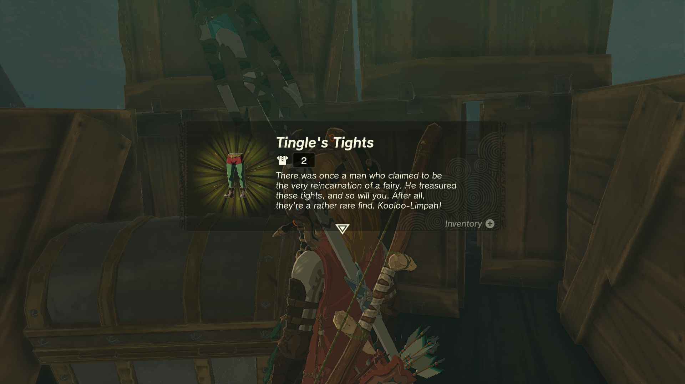
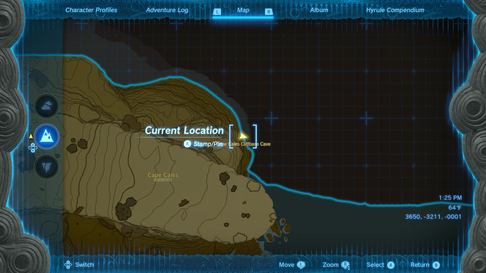
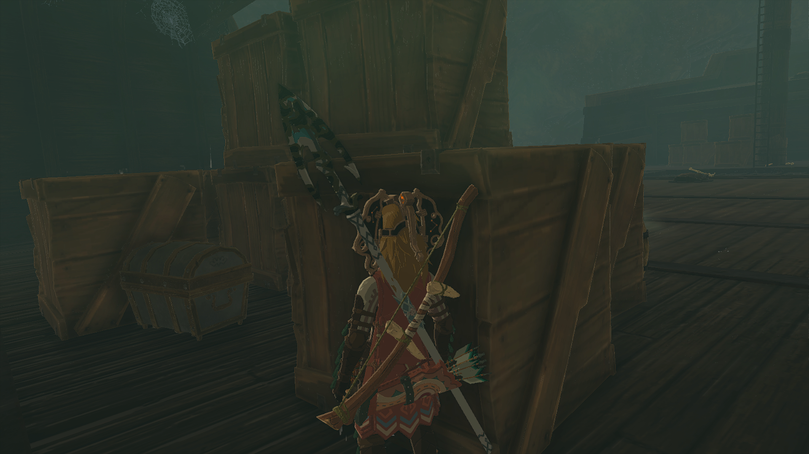

Tingle's Tights are a returning piece of Armor in The Legend of Zelda: Tears of the Kingdom. While previously a DLC exclusive they are now accessible to anyone who can find their location. Tingle's Tights are part of Tingle's Armor Set, and they cannot be upgraded or dyed. 

In this Tears of the Kingdom guide, you'll learn how to unlock Tingle's Tights and get details on this item's stats. 

## Tingle's Tights

  * **Description:** _"There was once a man who claimed to be the very reincarnation of a fairy. He treasured these tights, and so will you. After all, they're a rather rare find. Kooloo-Limpah!_ "

Tingle's Tights Base Stats

Defense  
Effect Bonus  
Cost  
Sale Value

2  
N/A  
N/A  
600

Tingle's Tights

Though Tingle's Shirt doesn't provide an individual Effect Bonus, if you wear Tingle's Hood, Shirt, and Tights together, you'll receive a **Night Speed Up Set Bonus**!

## Where to Find Tingle's Tights

Tingle's tights are located in Cape Cales Cliffbase Cave in East Necluda. The cave is found on the northeast side of Cape Cales at the base of the cliff. You can glide, swim, or take a boat to this cliff in the water. You will be met with a door that can be opened by whistling. 

There is a large ship straight inside the cave. To the left of the entrance, the usual place where armor chests are usually held is empty. To find the armor you must board the ship. Because of the shape you cannot climb up the side, there is a wood platform at the front of the ship you can use to ascend onto the deck. Be aware of the Stal enemies onboard. 

The chest containing the tights can be found behind a stack of boxes and barrels at the back of the ship. 

There is a small cave on the other side of the ship near the front with a Bubblfrog hiding inside. 

## Tingle's Tights Upgrades

Tingle's Tights _**cannot**_ be dyed in Hateno Village or upgraded at Great Fairy Fountains. 

### Up Next: Walkthrough

Previous

About IGN's Zelda TotK Guide Writers

Next

Walkthrough

### Top Guide Sections

  * Walkthrough
  * Zelda: Tears of The Kingdom Switch 2 Edition Guide
  * Zelda Notes Voice Memories
  * List of Side Quests and Side Adventures

### Was this guide helpful?

Leave feedback

### In This Guide

The Legend of Zelda: Tears of the KingdomNintendo EPD

Initial Release: May 12, 2023

Learn more

Go to comments