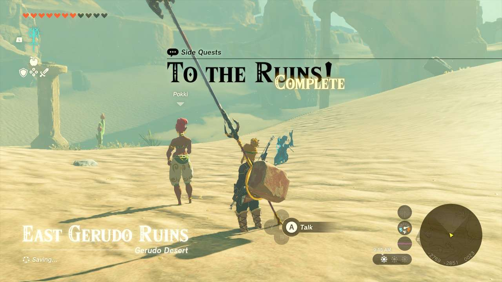
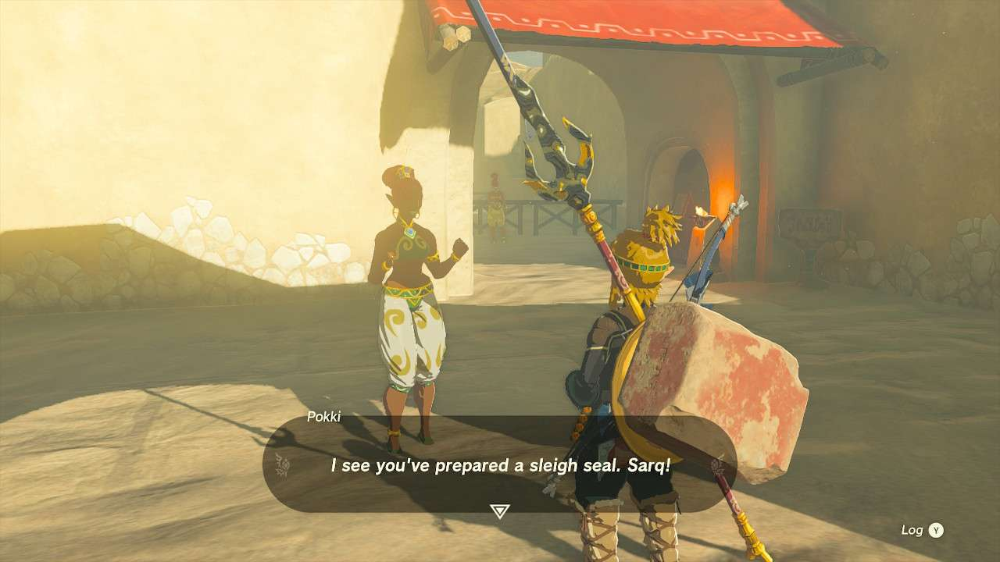
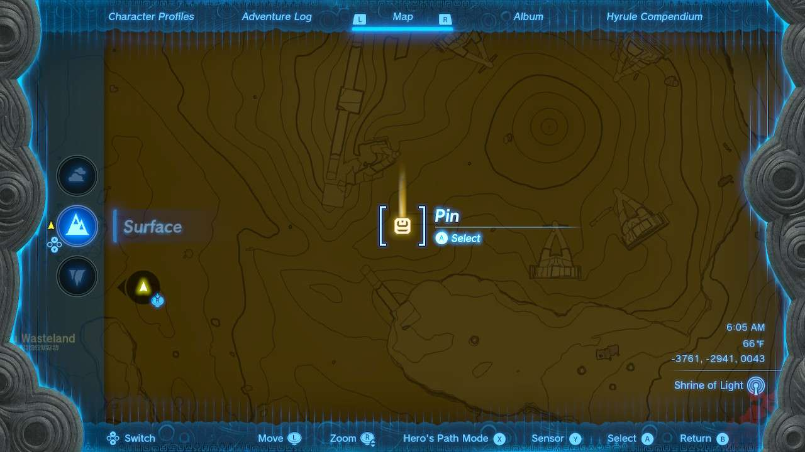
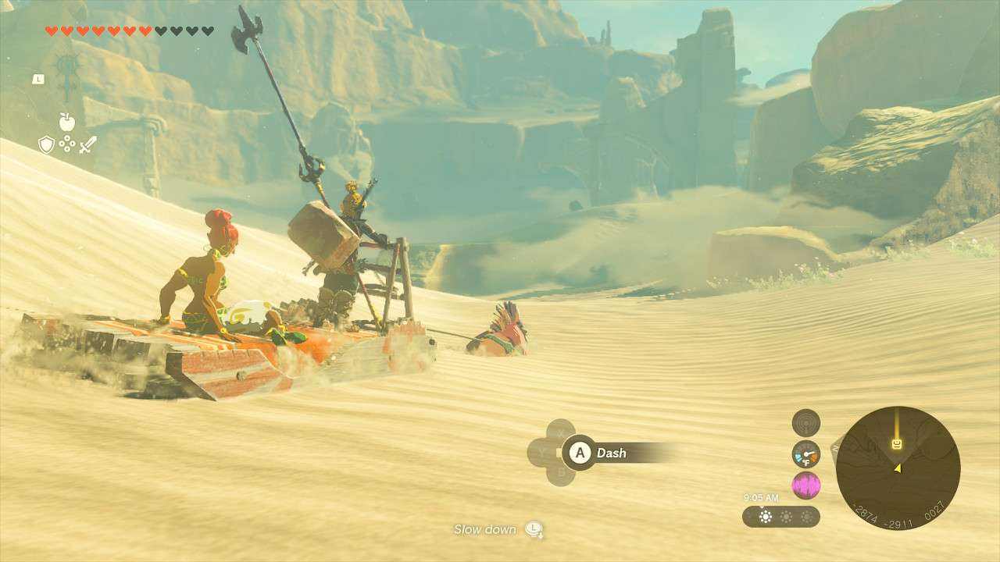

**To the Ruins!** is one of the many Side Quests to complete in The Legend of Zelda: Tears of the Kingdom. In this guide, we will teach you everything you need to know to complete To the Ruins!, including where to find it and what you will get as a reward. 

  * **Side Quest Location** : Gerudo Town
  * **Prerequisites** : Completing the Gerudo portion of Regional Phenomena
  * **Rewards** : 100 Rupees

Speak with **Pokki** near the east Sand Seal Rental place and she’ll start the quest, hoping you can take her somewhere where statues all face one another. You’ll need to rent a sand seal with a cart in order to do so. 

Where she wants to go is over on the far eastern side of the Gerudo Desert, in the **East Gerudo Ruins**. There are a few monster camps in the way, but even if you pull a straight line there, you should be fine. Careful near the mouth of the entrance, as there are some enemies just waiting for you there, so come at it from the left or right side. 

Once you’re in the Ruins, Pokki will stop the vehicle and reward you with 100 Rupees for your troubles. 

To the Ruins!

See the complete List of Side Quests and Side Adventures

### Up Next: Walkthrough

Previous

About IGN's Zelda TotK Guide Writers

Next

Walkthrough

### Top Guide Sections

  * Walkthrough
  * Zelda: Tears of The Kingdom Switch 2 Edition Guide
  * Zelda Notes Voice Memories
  * List of Side Quests and Side Adventures

### Was this guide helpful?

Leave feedback

Go to comments