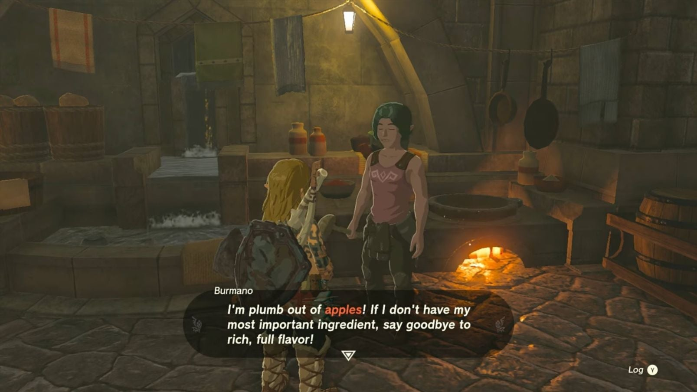

**Today's Menu** is one of the three Side Quests waiting for you in Lookout Landing. Unlike Side Adventures, Side Quests in The Legend of Zelda: Tears of the Kingdom are quick items to tick off your to-do list, so you can continue your adventures throughout Hyrule. 

To begin the **Today's Menu** Side Quest, head to **Lookout Landing** and make your way to the **Emergency Shelter**. If you haven't unlocked the Emergency Shelter yet, find and speak to an NPC named **Scorpis** in the center of the village. 

Once you're inside the Emergency Shelter, head over to the cooking pot at the side of the room and speak to **Burmano**. Burmano is looking to rustle up a delicious Fruit and Mushroom Mix, but he is missing a key ingredient, an **Apple**. 

You may have an Apple in your inventory already. But if you don’t, you can find them on trees around Hyrule or purchase one for 12 Rupees from the Shopkeep in Lookout Landing. 

Give Burmano the Apple so he can finish making his Fruit and Mushroom Mix and complete the Side Quest. He will give you the dish as a reward. 

Today's Menu

See the complete List of Side Quests and Side Adventures

### Up Next: Walkthrough

Previous

About IGN's Zelda TotK Guide Writers

Next

Walkthrough

### Top Guide Sections

  * Walkthrough
  * Zelda: Tears of The Kingdom Switch 2 Edition Guide
  * Zelda Notes Voice Memories
  * List of Side Quests and Side Adventures

### Was this guide helpful?

Leave feedback

### In This Guide

The Legend of Zelda: Tears of the KingdomNintendo EPD

Initial Release: May 12, 2023

Learn more

Go to comments