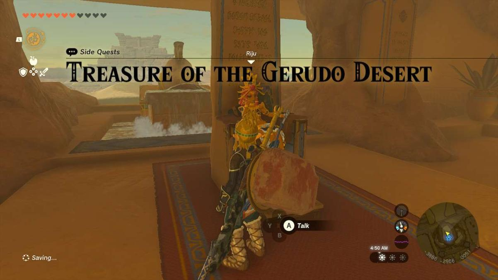
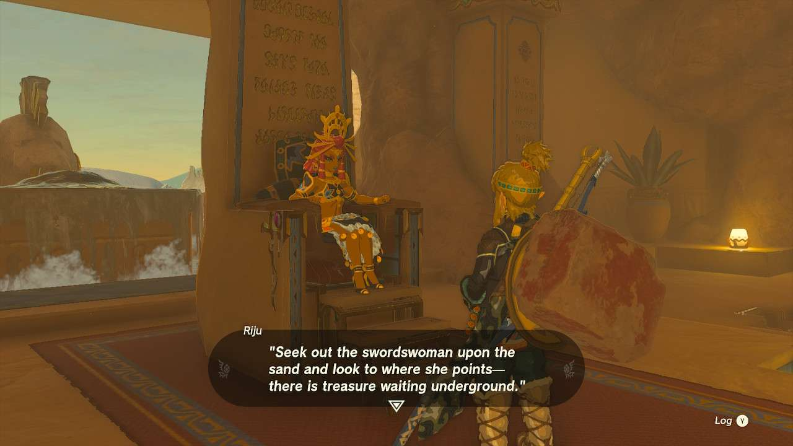
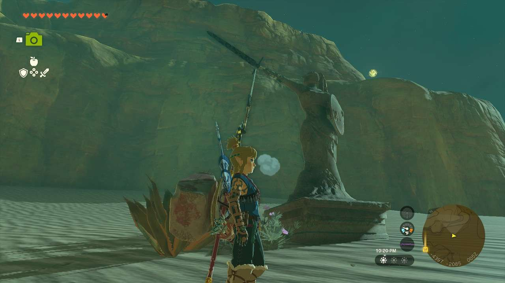
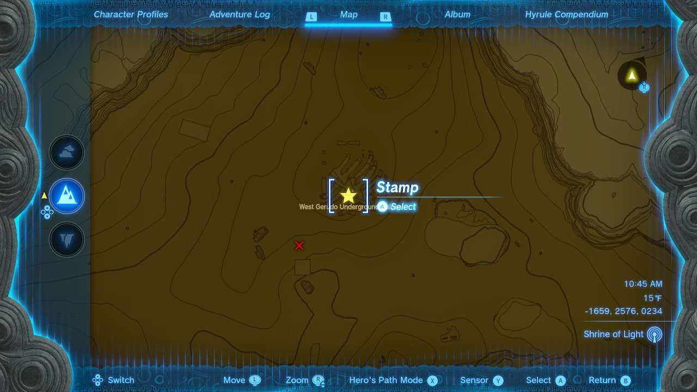
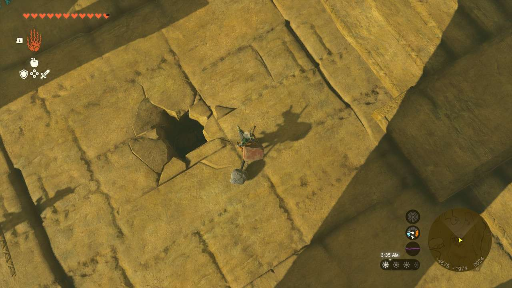
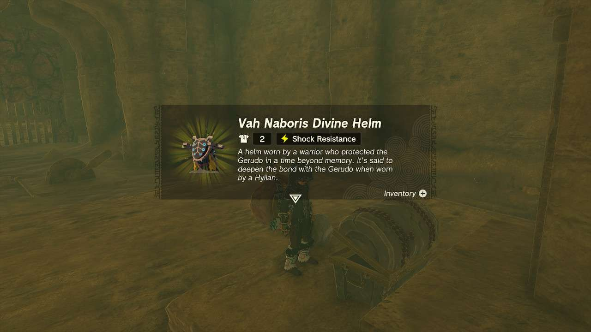

**Treasure of the Gerudo Desert** is one of the many Side Quests to complete in The Legend of Zelda: Tears of the Kingdom. In this guide, we will teach you everything you need to know to complete Treasure of the Gerudo Desert, including where to find it and what you will get as a reward. 

  * **Side Quest Location** : Gerudo Town, then West Gerudo Underground Ruins, Gerudo Highlands (in the far north of the Gerudo Desert)
  * **Prerequisites** : Finish the Gerudo Desert portion of Regional Phenomena
  * **Rewards** : Vah Naboris Divine Helm

After speaking to **Riju** following the events of Riju of Gerudo Town, you can activate the quest. However, the cave and the item you find at the end can be found at practically any time. Riju does help you out with a piece of prophecy: _“Seek out the swordswoman upon the sand and look to where she points - there is treasure waiting underground.”_

Similar to in The Depths where you can follow the pointing of several of the statues to certain destinations, this is the same tactic here. Around the north of the desert, you can follow several swordswomen statues pointing in various directions that will eventually lead you to a large rib cage protruding from the ground that you need to look on the ground in. 

Alternatively, the entrance to **West Gerudo Underground Ruins** is around the center of the skeletal remains. There is a Like Like protecting it, but if you can either ignore that or get rid of it, you’ll notice a hole in the ground. The hole needs a Bomb Flower or Zonai Time Bomb thrown in it to clear the way, which will let you drop down._It’s highly recommended you bring one or several weapons dedicated to rock smashing before you head in_. 

Once you’re underground, you need to start breaking the wall of rocks around you. If you didn’t bring rock-breaking weapons, there are several stones laying around as well as more statues with swords you can fuse them to. The pointing statues will come back when you start clearing rock, pointing you in the direction you need to go. It’ll even lead you to the Bubbulfrog in the cave, which then points you to the final area you need to go. 

At the very end of the hall, you’ll find a chest with the **Va Naboris Divine Helm**. You can Ultrahand the lever to open the gate and get back to the starting area and leave and head back to speak to Riju to complete the quest. 

Treasure of the Gerudo Desert

See the complete List of Side Quests and Side Adventures

### Up Next: Walkthrough

Previous

About IGN's Zelda TotK Guide Writers

Next

Walkthrough

### Top Guide Sections

  * Walkthrough
  * Zelda: Tears of The Kingdom Switch 2 Edition Guide
  * Zelda Notes Voice Memories
  * List of Side Quests and Side Adventures

### Was this guide helpful?

Leave feedback

Go to comments