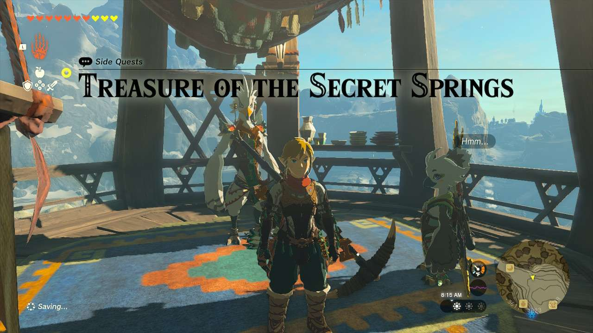
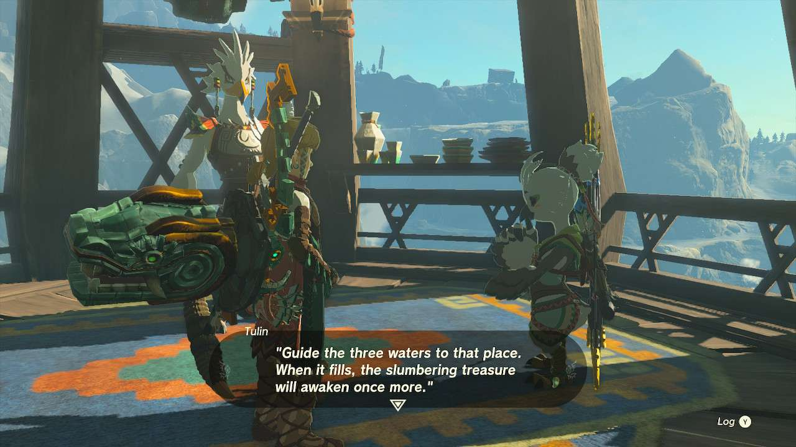
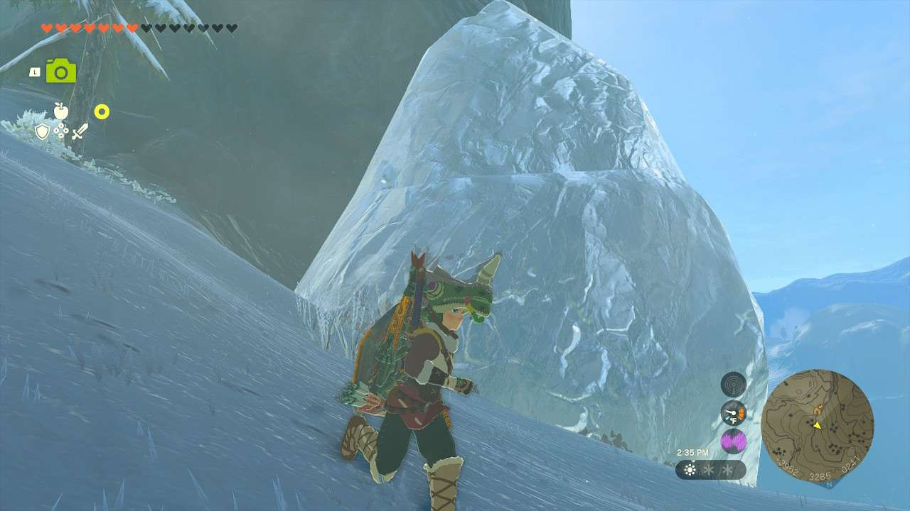
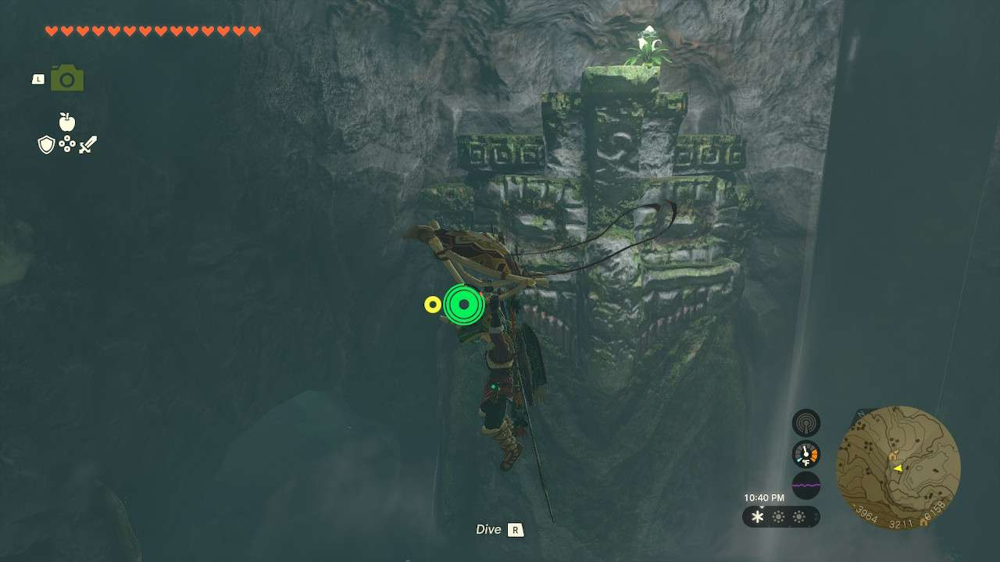

**Treasure of the Secret Springs** is one of the many Side Quests to complete in The Legend of Zelda: Tears of the Kingdom. In this guide, we will teach you everything you need to know to complete Treasure of the Secret Springs, including where to find it and what you will get as a reward. 

  * **Side Quest Location** : Rito Village, then North Biron Snowshelf Cave, Hebra Mountains
  * **Prerequisites** : Finish the Hebra Mountains portion of Regional Phenomena
  * **Rewards** : Vah Medoh Divine Helm

Following the events of Tulin of Rito Village, you can speak to **Tulin** once again while in Rito Village. He’ll tell you about a secret treasure and the prophecy around it: _“Guide the three waters to that place. When it fills, the slumbering treasure will awaken once more.”_

The location of the treasure is the **North Biron Snowshelf Cave** (-3960, 2862, -0014). To enter the cave, you’ll have to melt the enormous glacier that’s blocking the entrance. Following that, break open the hole in the floor and head down. 

You’ll find the “secret springs” here, with a giant statue in the middle of the room with an upward draft. You’ll need to fly and stay in the air to shoot bomb arrows at the breakable rocks on the surrounding cave walls. You need to find the three waterfalls, located in the **east, west, and south** (from the view of the statue: **one to the right, a couple to the left, and the one almost directly in front of it**). Some Ice Keese are in most of the others, but some have Bomb Flowers. _Note: if you get hurt by anything in here, it is spring water, so take a swim and it will heal you up_. 

Once these waterfalls are found, they’ll fill up the pool below and move the statue. Once it does, you can make your way to the chest containing the Vah Medoh Divine Helm. You can head back and tell Tulin the good news to finish the quest.

Treasure of the Secret Springs

See the complete List of Side Quests and Side Adventures

### Up Next: Walkthrough

Previous

About IGN's Zelda TotK Guide Writers

Next

Walkthrough

### Top Guide Sections

  * Walkthrough
  * Zelda: Tears of The Kingdom Switch 2 Edition Guide
  * Zelda Notes Voice Memories
  * List of Side Quests and Side Adventures

### Was this guide helpful?

Leave feedback

Go to comments