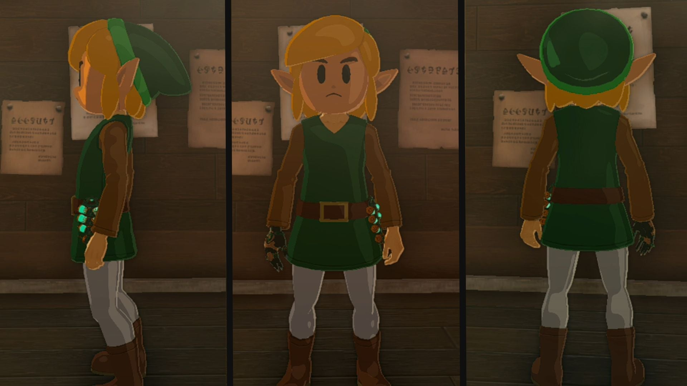
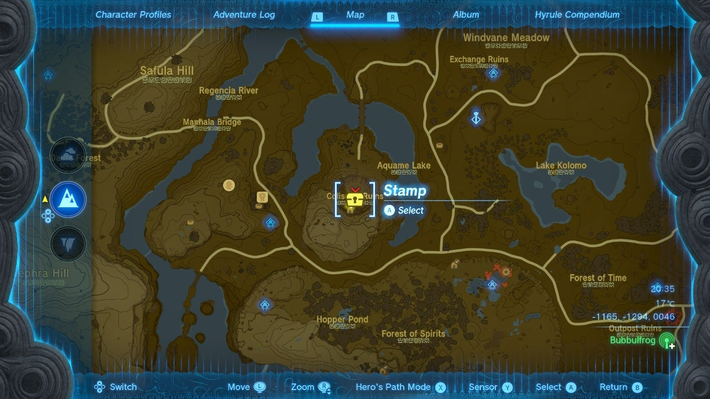
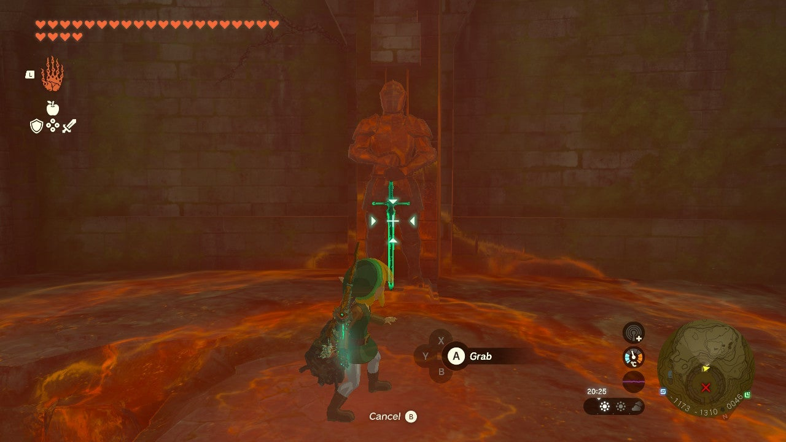
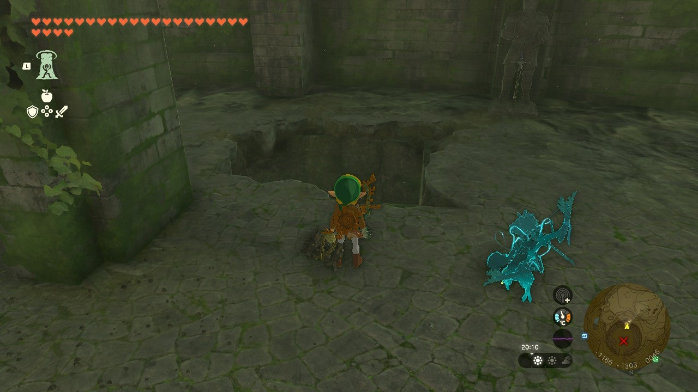
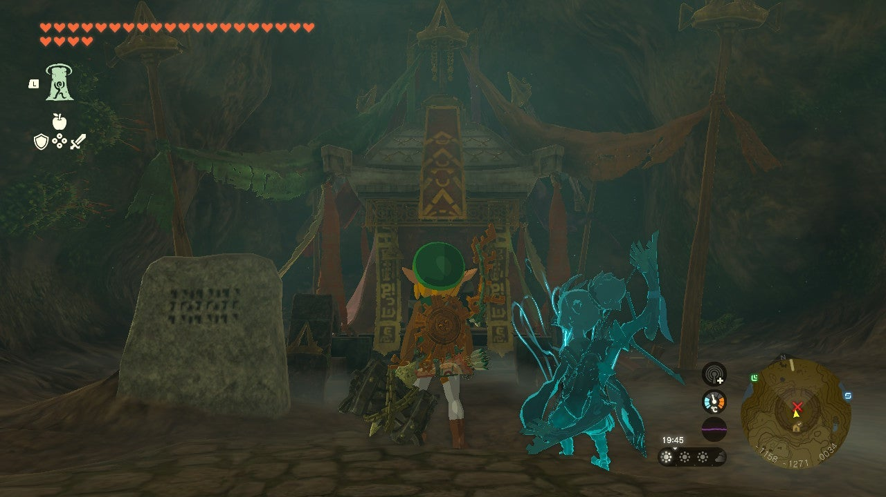

The **Trousers of Awakening** are one of three pieces of armor that make up the Armor of Awakening Set in The Legend of Zelda: Tears of the Kingdom. The Trousers of Awakening are received as a reward for completing the second of three **Misko’s Treasure of Awakening** quests. 

You can also find the Armor of Awakening without the hassle by scanning the Link (Link’s Awakening) Amiibo!

In this guide, we will give you all the information you need about the Trousers of Awakening, including how to get them, their stats, and their upgrade requirements. 

## Trousers of Awakening

**Official description** : _Legend says these trousers were worn by a hero explored a mysterious island that one could visit but not leave. The item makes one want to wear it but also not wear it._

Trousers of Awakening Base Stats

Defense  
Effect Bonus  
Cost  
Sale Value

3  
N/A  
N/A  
600

Trousers of Awakening

## How to Get the Trousers of Awakening

There are two ways to get your hands on the Trousers of Awakening in The Legend of Zelda: Tears of the Kingdom. 

### Scan the Link (Link's Awakening) Amiibo

If you own the Link (Link's Awakening) Amiibo, **hold L** to open your abilities wheel, then select the Amiibo icon. Get Link to an open area, then place your Amiibo near the NFC touchpoint on your Switch or controller, and you'll have the chance to unlock the Armor of the Awakening. 

Looking for more thorough instructions on how to use Amiibos or curious about other Amiibo rewards? Check out our comprehensive Amiibo Unlocks guide for more details!

## Misko’s Treasure of Awakening II Walkthrough

If you don’t have the Amiibo, you can still get your hands on the Trousers of Awakening by completing the accompanying side quest; Misko's Treasure of Awakening II. 

The riddle Misko gives you on the second leg of the Armor of Awakening treasure hunt reads as follows: 

_“In the ruins of Hyrule Field, where warriors once tested themselves in battle, offer your soldier’s claymore to the two sculpted soldiers. The sword will point the way to my treasure.”_

The location Misko is hinting to is the Coliseum Ruins in South Hyrule Field. You can get there by gliding southwest from Hyrule Field Skyview Tower, or by riding northeast from Outskirt Stable. 

**Coliseum Ruins coordinates** : -1173, -1310, 0046. 

The Coliseum Ruins are guarded by a Thunder Gleeok, so you will have to come prepared for a fight with a good stash of strong weapons and eyeballs. 

If you would like a full walkthrough on how to take down a Thunder Gleeok, check out our Thunder Gleeok guide.

Once you clear out that nasty enemy, make your way over to the southern wall where you will find two soldier sculptures. Pick up the soldier’s claymore lying on the ground beside the soldier on the right and place it back on the statue. 

As soon as you place the sword back in its rightful place, a large hole will open up in the ground leading to the Coliseum Ruins Cave. 

**Coliseum Ruins Cave coordinates** : -1166, -1303, 0046. 

Drop down into the cave below to find the treasure chest containing Misko’s treasure: The Trousers of Awakening. 

**Trousers of Awakening coordinates** : -1158, -1271, 0034. 

## Trousers of Awakening Upgrade Requirements

The Trousers of Awakening cannot be dyed, but it can be upgraded. If you find all three pieces of the Armor of Awakening Set, upgrade them each twice, and wear them together, you will unlock an **Attack Up** Set Bonus.

Trousers of Awakening Upgrades

Level  
Materials  
Labor Cost  
Defense Level

Base  
N/A  
N/A  
3

★  
10x Luminous Stone1x Star Fragment  
10 Rupees  
5

★★  
15x Luminous Stone1x Star Fragment  
50 Rupees  
8

★★★  
20x Luminous Stone1x Star Fragment  
200 Rupees  
12

★★★★  
30x Luminous Stone1x Star Fragment  
500 Rupees  
20

### Up Next: Walkthrough

Previous

About IGN's Zelda TotK Guide Writers

Next

Walkthrough

### Top Guide Sections

  * Walkthrough
  * Zelda: Tears of The Kingdom Switch 2 Edition Guide
  * Zelda Notes Voice Memories
  * List of Side Quests and Side Adventures

### Was this guide helpful?

Leave feedback

### In This Guide

The Legend of Zelda: Tears of the KingdomNintendo EPD

Initial Release: May 12, 2023

Learn more

Go to comments