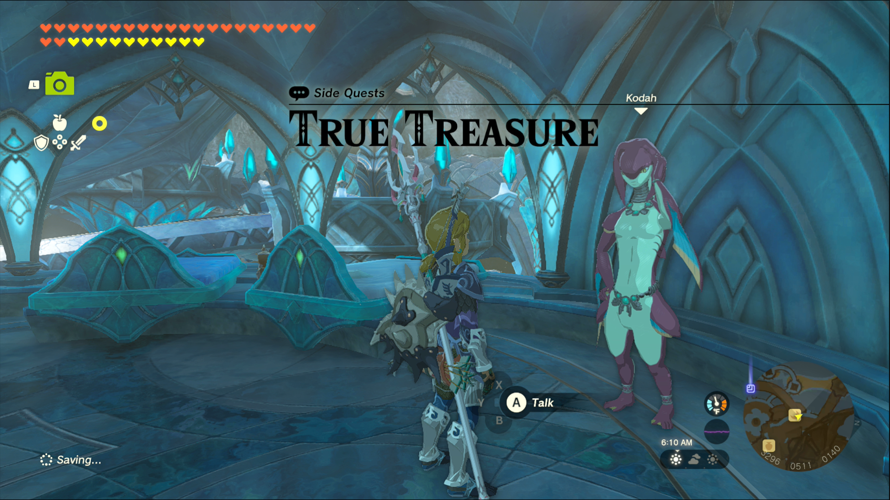
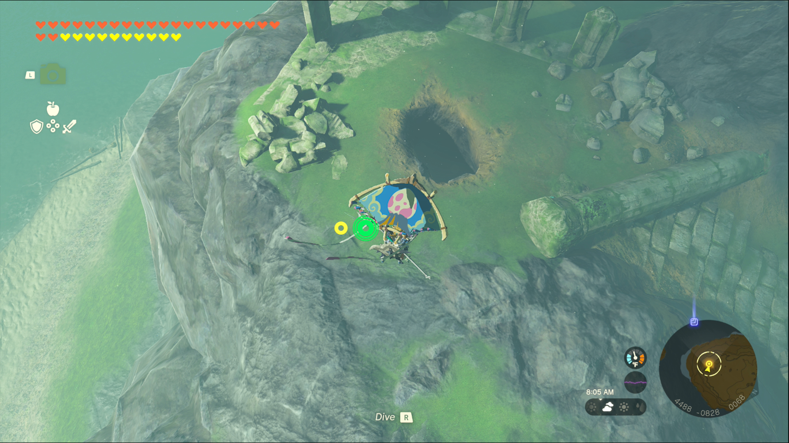
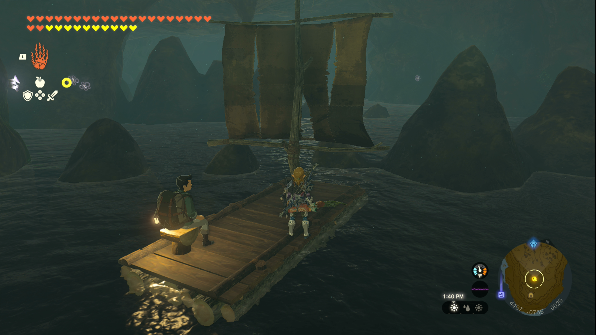
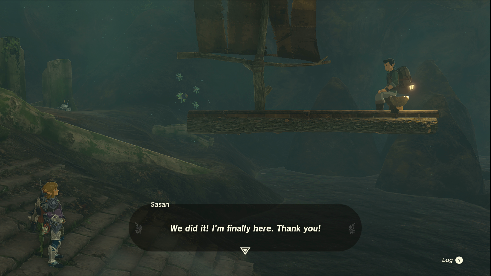

True Treasure is one of the Side Quests you’ll discover in the Lanayru Great Spring region. Side Quests are quests in The Legend of Zelda: Tears of the Kingdom that are relatively short or simple chores that can earn you small rewards or services. 

## True Treasure

To start the Side Quest “True Treasure” you first need to complete the Main Quest “Sidon of the Zora.” Then go to The Seabed Inn in Zora’s Domain, and speak to Kodah, a Zora spending time at the inn. 

She’s learned of a possible treasure at a shrine hidden at Tarm Point, and her daughter has run off to find it. Tarm Point is southeast of Zora’s Domain and northeast of Mount Lanayru. If you’ve unlocked any shrines at the South Lanayru Sky Archipelago you can teleport up and drop down onto Tarm Point as well. 

Once you’ve arrived, head inside to meet with Sasan, a Hyrulian standing beside a raft. He can’t figure out how to get the raft across the cave due to the rising and falling water. 

There are wooden sticks and Korok fronds nearby that you can use to propel the raft forward, so speak to Sasan to get him to join you on the raft. Carefully push the raft along, doing your best to avoid the rock spikes that appear when the water recedes. If the raft tilts too much, Sasan will force you back to the beginning. 

Once you make it to the end, you can lift the raft up toward the shrine and Sasan will automatically join Finley on the shore. Sasan and Finley will give you a pair of Opals as a reward for your help. 

True Treasure

See the complete List of Side Quests and Side Adventures

### Up Next: Walkthrough

Previous

About IGN's Zelda TotK Guide Writers

Next

Walkthrough

### Top Guide Sections

  * Walkthrough
  * Zelda: Tears of The Kingdom Switch 2 Edition Guide
  * Zelda Notes Voice Memories
  * List of Side Quests and Side Adventures

### Was this guide helpful?

Leave feedback

### In This Guide

The Legend of Zelda: Tears of the KingdomNintendo EPD

Initial Release: May 12, 2023

Learn more

Go to comments