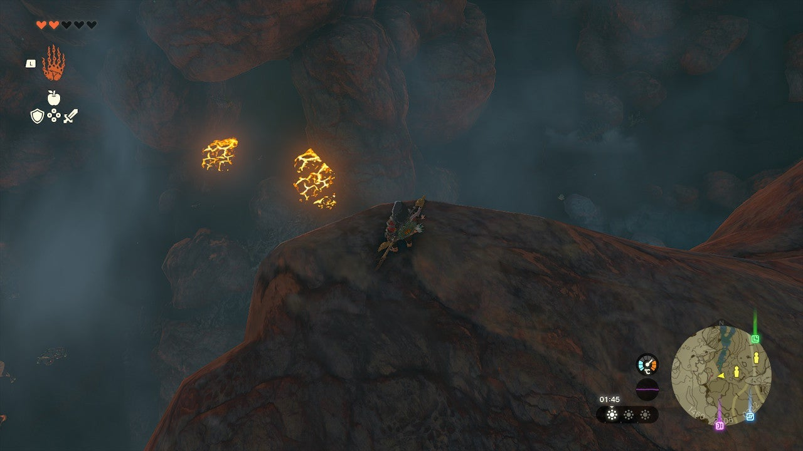
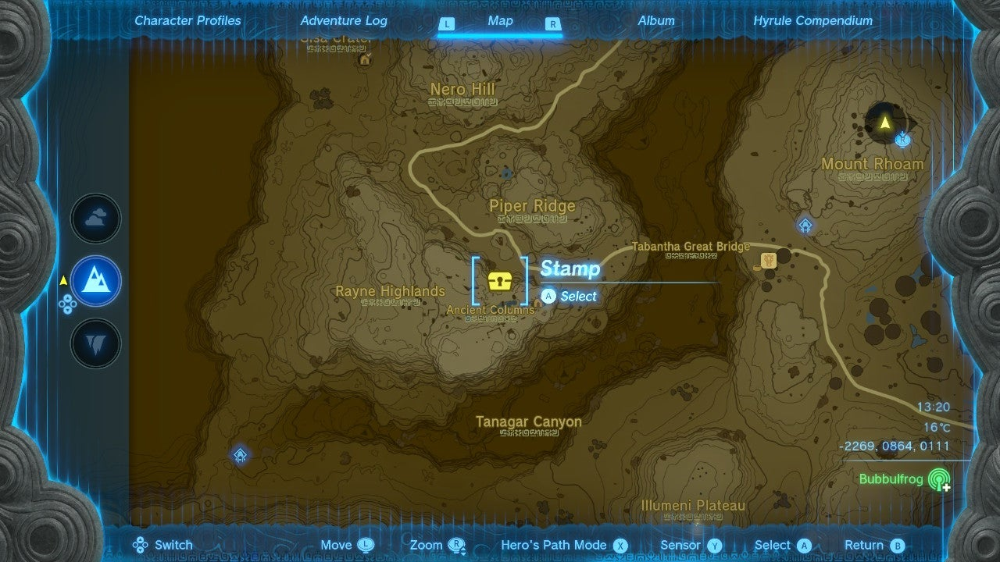
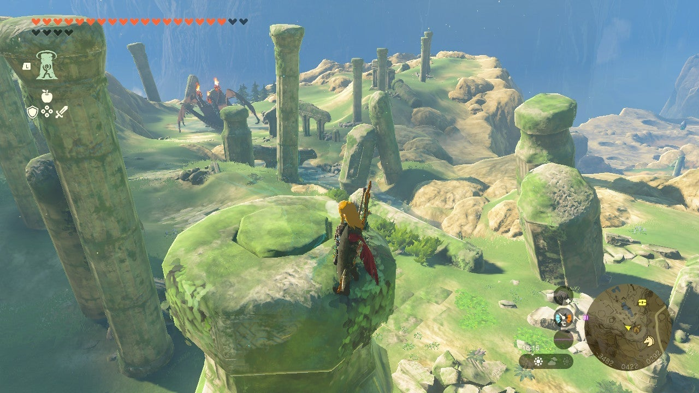
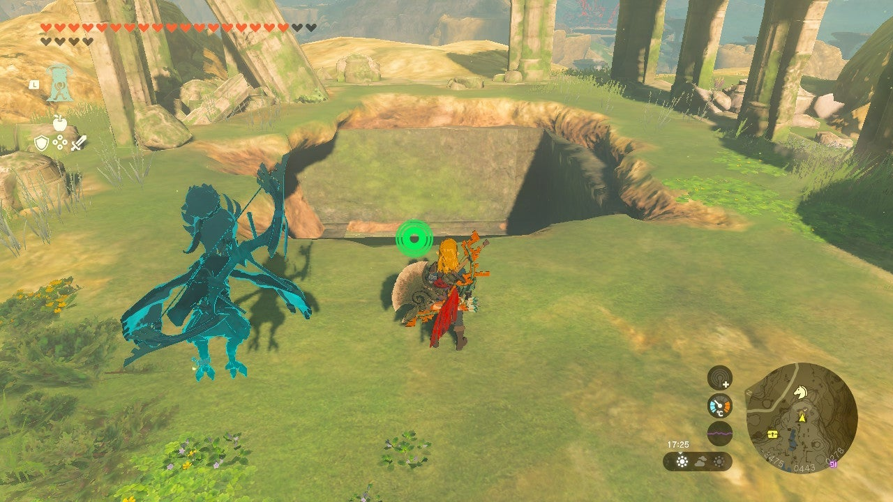
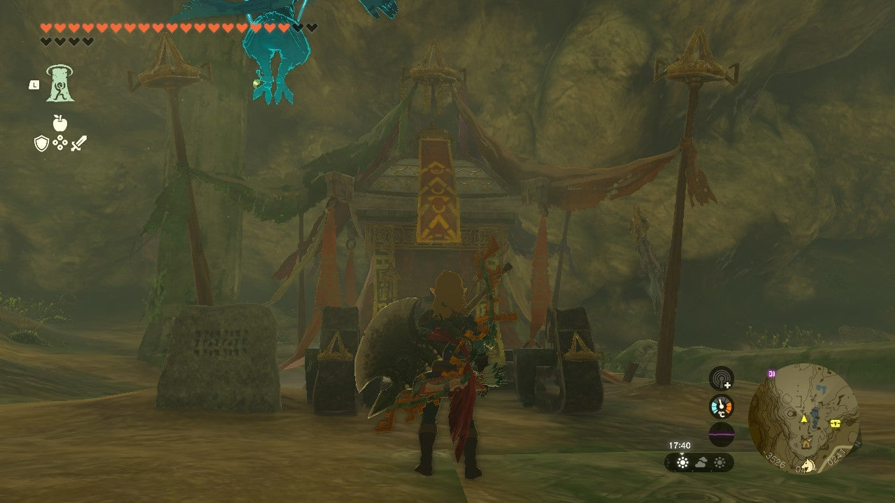

The **Tunic of Awakening** is one of three pieces of armor that make up the Armor of Awakening Set in The Legend of Zelda: Tears of the Kingdom. The Tunic of Awakening is received as a reward for completing the first of three **Misko’s Treasure of Awakening** quests. 

You can also find the Armor of Awakening without the hassle by scanning the Link (Link’s Awakening) Amiibo!

In this guide, we will give you all the information you need about the Tunic of Awakening, including how to get it, its stats, and its upgrade requirements. 

## Tunic of Awakening

**Official description** : _Legend says this armor was worn by a hero who explored a mysterious island that one could visit but not leave. The item makes one want to wear it but also not wear it._

Tunic of Awakening Base Stats

Defense  
Effect Bonus  
Cost  
Sale Value

3  
N/A  
N/A  
600

Tunic of Awakening

## How to Get the Tunic of Awakening

There are two ways to get your hands on the Tunic of Awakening in The Legend of Zelda: Tears of the Kingdom. 

### Scan the Link (Link's Awakening) Amiibo

If you own the Link (Link's Awakening) Amiibo, **hold L** to open your abilities wheel, then select the Amiibo icon. Get Link to an open area, then place your Amiibo near the NFC touchpoint on your Switch or controller, and you'll have the chance to unlock the Armor of the Awakening. 

Looking for more thorough instructions on how to use Amiibos or curious about other Amiibo rewards? Check out our comprehensive Amiibo Unlocks guide for more details!

## Misko’s Treasure of Awakening I Walkthrough

If you don’t have the Amiibo, you can still get your hands on the Tunic of Awakening by completing its accompanying side quest; Misko’s Treasure of Awakening I. 

To unlock this quest, you need to clear the **Goronbi River Cave** in the western part of Eldin. First, travel south from Goron City until the road splits in two, then walk past the two Goron merchants in the west. Look down from the cliffs to see the cave entrance below, at coordinates 1415, 2106, 0287. 

Defeat the Horriblin and Fire Like inside, and open the treasure chest at the end of the cave. This will make the stone wall next to you disappear, revealing a stone pillar. Interact with this pillar to start Misko's Treasure of Awakening I. 

The treasure, Misko's **Tunic of Awakening** , is inside the **Ancient Columns Cave** in the Hyrule Ridge and Tabantha Frontier region. To find your way to the cave, first head to the Ancient Columns in Hyrule Ridge. You can make your way there by riding west of the Tabantha Bridge Stable. 

The area is guarded by a Flame Gleeok, so if you approach the Ancient Columns from the front, you will have to go through it to find the treasure. 

Check out our Flame Gleeok guide for some tips to help you out in the fight!

There are quite a few columns here, but only one correct one. The column you’re after has a button on top. You can find the right column near the edge of the cliff pointing toward Tabantha Bridge Stable. 

**Ancient Column Cave coordinates** : -3484, 0421, 0292. 

Stand on the pressure plate to open the entrance to the Ancient Columns Cave. Drop in to claim your reward. 

**Tunic of Awakening coordinates** : -3526, 0414, 0241. 

## Tunic of Awakening Upgrade Requirements

The Tunic of Awakening cannot be dyed, but it can be upgraded. If you find all three pieces of the Armor of Awakening Set, upgrade them each twice, and wear them together, you will unlock an **Attack Up** Set Bonus.

Tunic of Awakening Upgrades

Level  
Materials  
Labor Cost  
Defense Level

Base  
N/A  
N/A  
3

★  
10x Luminous Stone1x Star Fragment  
10 Rupees  
5

★★  
15x Luminous Stone1x Star Fragment  
50 Rupees  
8

★★★  
20x Luminous Stone1x Star Fragment  
200 Rupees  
12

★★★★  
30x Luminous Stone1x Star Fragment  
500 Rupees  
20

### Up Next: Walkthrough

Previous

About IGN's Zelda TotK Guide Writers

Next

Walkthrough

### Top Guide Sections

  * Walkthrough
  * Zelda: Tears of The Kingdom Switch 2 Edition Guide
  * Zelda Notes Voice Memories
  * List of Side Quests and Side Adventures

### Was this guide helpful?

Leave feedback

Go to comments