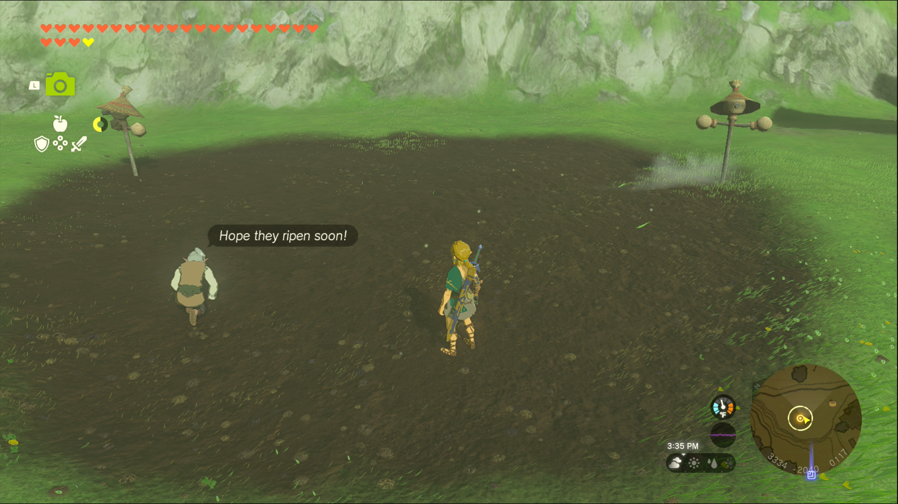

Uma’s Garden is one of the Side Quests you’ll discover in the Mount Lanayru region. Side Quests are quests in The Legend of Zelda: Tears of the Kingdom that are relatively short or simple chores that can earn you small rewards or services. 

## Uma’s Garden

To start the Side Quest “Uma’s Garden” you need to complete “Teach Me a Lesson II” with Symin at the school. For helping teach the students, he gives you permission to use the school’s field, and you’ll need to speak to Uma to help set things up. After her explanation, you can give her one of the vegetables you want to grow. 

She’ll get to work and explain that you need to return after some time, but staying at an inn or campfire to pass the time won’t count. Once you’ve been away for a few hours, return to the field and speak to Uma to complete the quest. Since the quest is essentially a tutorial for the field, the opportunity to grow more things is your reward. 

Uma's Garden

See the complete List of Side Quests and Side Adventures

### Up Next: Walkthrough

Previous

About IGN's Zelda TotK Guide Writers

Next

Walkthrough

### Top Guide Sections

  * Walkthrough
  * Zelda: Tears of The Kingdom Switch 2 Edition Guide
  * Zelda Notes Voice Memories
  * List of Side Quests and Side Adventures

### Was this guide helpful?

Leave feedback

### In This Guide

The Legend of Zelda: Tears of the KingdomNintendo EPD

Initial Release: May 12, 2023

Learn more

Go to comments