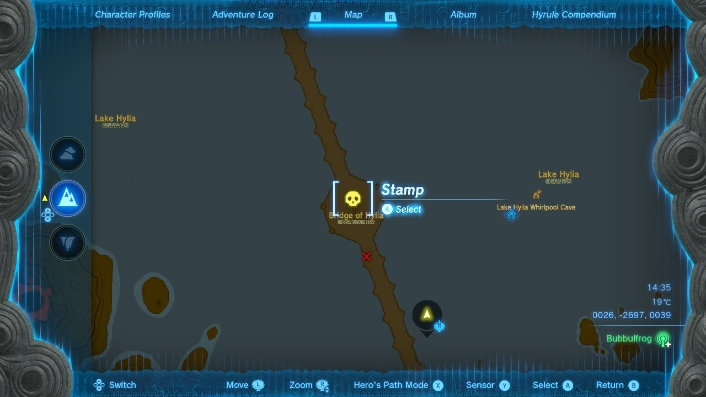
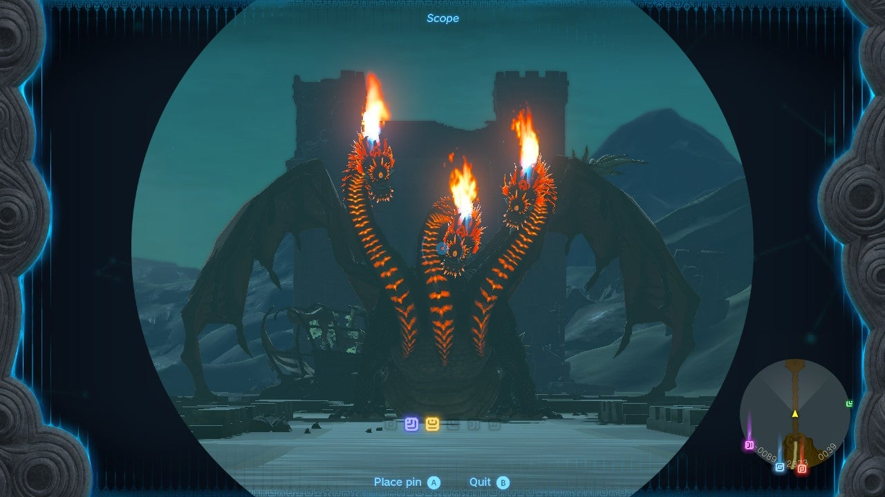

The Unknown Three-Headed sidequest is the fifth of six monster-hunting quests available from the head of the monster-control crew, Gralens. Each quest is a lucrative, netting Link 100 Rupees as a reward for slaying the beast in question. Link additionally receives a Silver Rupee for completing the first three, and a Diamond for the second set of missions. 

To find Gralens, you have to first complete the Bring Peace to Hyrule Field quest. The monster-controller will then be a resident of the Emergency Shelter at the center of Lookout Landing. 

  * **Side Quest Location:** Lookout Landing, Central Hyrule
  * **Prerequisites:** Complete Bring Peace to Hyrule Field and the three WANTED quests
  * **Rewards:** Silver Rupee (100), and a Gold Rupee (300) for the completion of all three WANTED quests.

Talk to Gralens, who is standing by the table near the map in the underground Emergency Center in the middle of Lookout Landing. Ask Gralens about "Unusual monsters" -- an option that is available only after you complete the three "big monsters" WANTED quests. 

You can then accept the three quests: Unknown Sky Giant, **Unknown Three-Headed Monster** , and Unknown Huge Silhouette. You should accept all three while you're here. 

Accept Unknown Three-Headed Monster and Gralen will give you the location of a Flame Gleeok on the Bridge of Hylia -- the longest bridge in all of Hyrule. Travel to the closest location to the bridge you've got unlocked. The Gleeok is sitting right at its center, as marked on the map. 

## How to Defeat the Gleeok

Taking down a Flame Gleeok takes a bit of work -- and a lot of arrows. To defeat a Flame Gleeok, you have to hit each of the heads directly in the eye with an arrow. Each of the heads act independently, so it will continue attacking you until you hit all three. Once you do, the Flame Gleeok will fall to the ground, allowing you to rush in and start wailing on its heads with your strongest weapon possible. Ice weapons are great since that is their weakness, but the stronger, the better. 

You can use updrafts created by the Gleeok's flames to get airborne and more easily aim your arrows. For detailed combat strategies, consult our guide's Flame Gleeok page for details. 

Once you have defeated the Flame Gleeok, collect your spoils, travel back to Lookout Landing and turn in the quest to receive 100 Rupees. 

If this is the third of the Unusual Monsters quests you've completed, you'll also receive a Diamond. 

Unknown Three-Headed Monster

See the complete List of Side Quests and Side Adventures

### Up Next: Walkthrough

Previous

About IGN's Zelda TotK Guide Writers

Next

Walkthrough

### Top Guide Sections

  * Walkthrough
  * Zelda: Tears of The Kingdom Switch 2 Edition Guide
  * Zelda Notes Voice Memories
  * List of Side Quests and Side Adventures

### Was this guide helpful?

Leave feedback

Go to comments