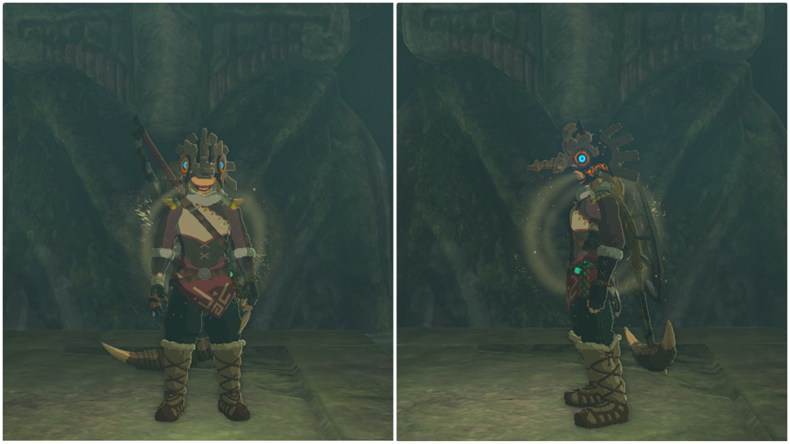

The **Vah Medoh Divine Helm** is a unique Armor Piece in The Legend of Zelda: Tears of the Kingdom, modeled after the Divine Beast Vah Medoh. This Rito-made Armor provides **Cold Resistance** and can be worn in tandem with other Cold Resistance Armor pieces, such as the **Snowquill Armor Set**, to gain the full effects of Cold Resistance. 

In this guide, you'll learn everything you need to know about the Vah Medoh Divine Helm, including where to find it. 

## Vah Medoh Divine Helm

  * **Description:** "_A helm worn by a warrior who protected the Rito in a time beyond memory. It's said to deepen the bond with the Rito when worn by a Hylian_ ".

Vah Medoh Divine Helm

Defense  
Effect Bonus

2  
1 Cold Resistance

Vah Medoh Divine Helm

### Where to Find the Vah Medoh Divine Helm

The Vah Medoh Divine Helm can be found in a Chest inside the **North Biron Snowshelf Cave** in the **Hebra Mountains**. 

**Coordinates:** -3960, 3267, 0140 

You can reveal the cave entrance by **melting the large ice chunk** blocking the opening. Once inside, smash open the breakable rock floor to enter the cave level below. 

Inside this lower level of the cave, use the air vent at the center of the pond to fly up into the air and **shoot arrows with Bomb Flowers** at each of the three breakable rock spots on the cave walls. Only three of these breakable rock spots - found to the east, west, and south - will open up **waterfalls**. Others will open up small caves of Ice Keese. 

With the three waterfalls unblocked, the giant Zonai statue will move aside and **reveal a room** with a treasure chest. Inside the Chest is the Vah Medoh Divine Helm. 

### Up Next: Vah Naboris Divine Helm

Previous

Tunic of Memories

Next

Vah Naboris Divine Helm

### Top Guide Sections

  * Walkthrough
  * Zelda: Tears of The Kingdom Switch 2 Edition Guide
  * Zelda Notes Voice Memories
  * List of Side Quests and Side Adventures

### Was this guide helpful?

Leave feedback

Go to comments