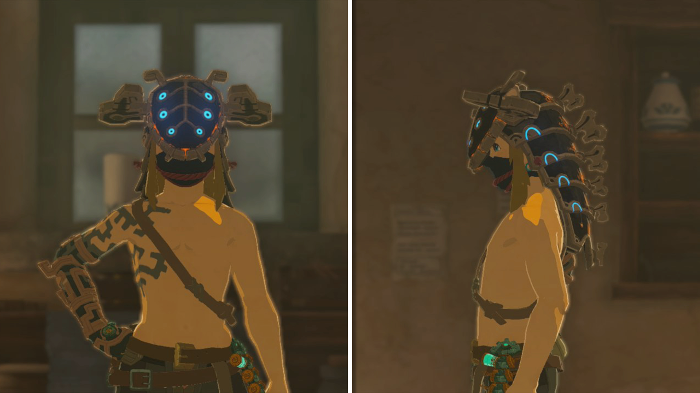
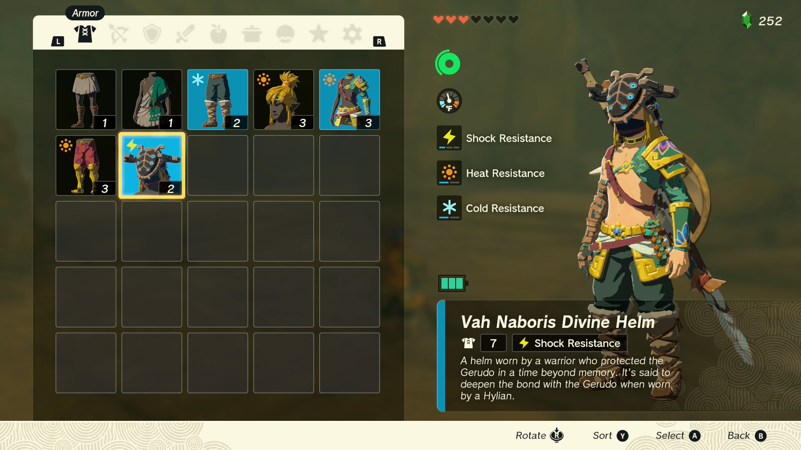
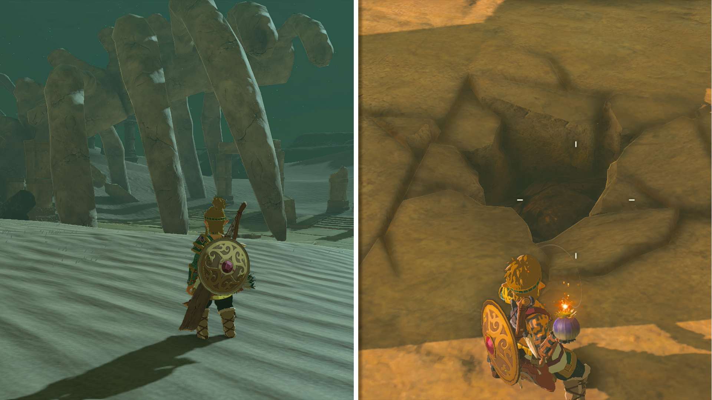
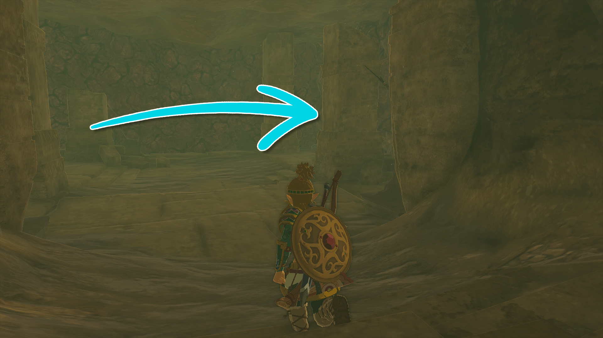
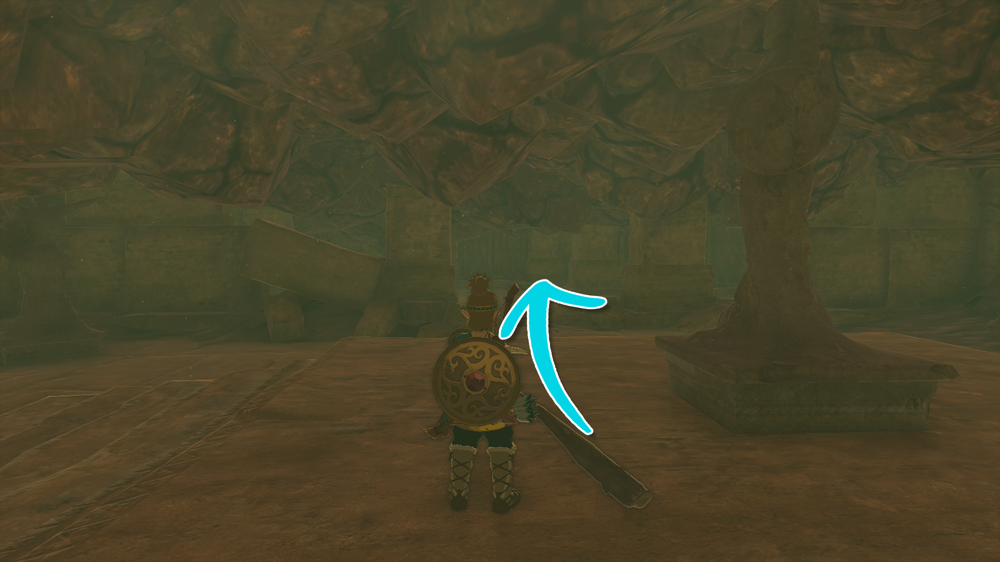
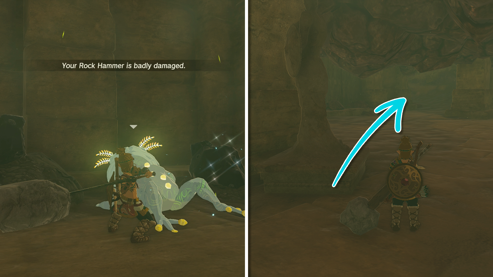
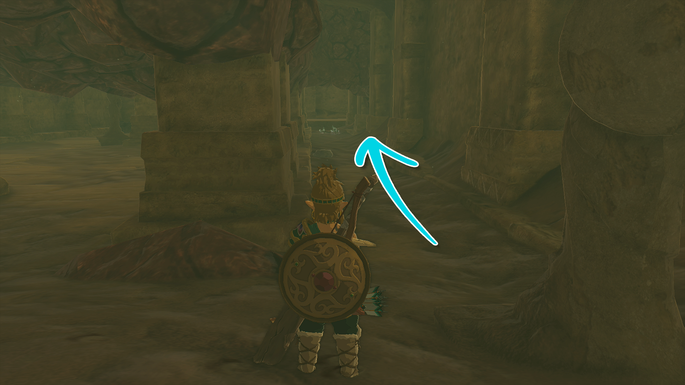
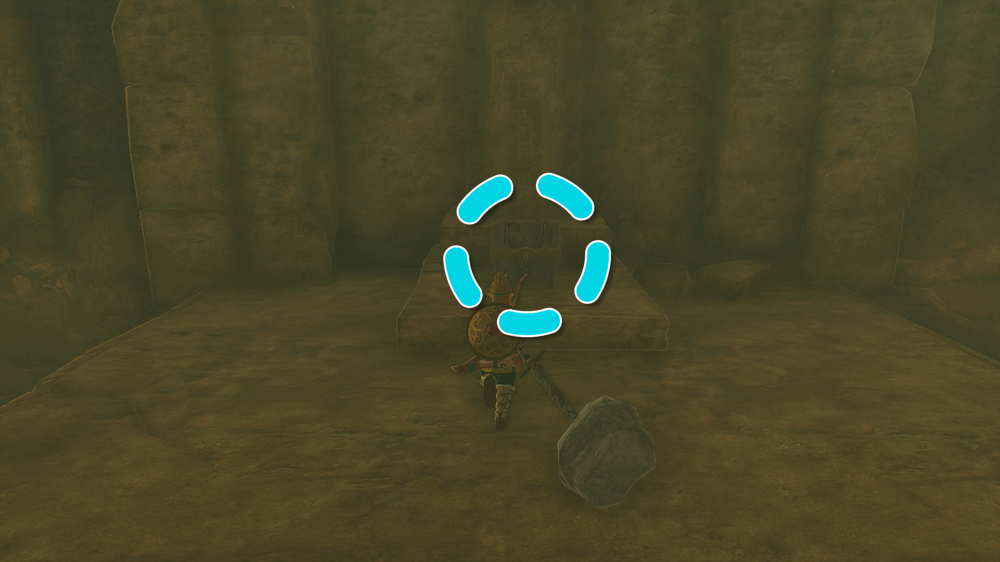
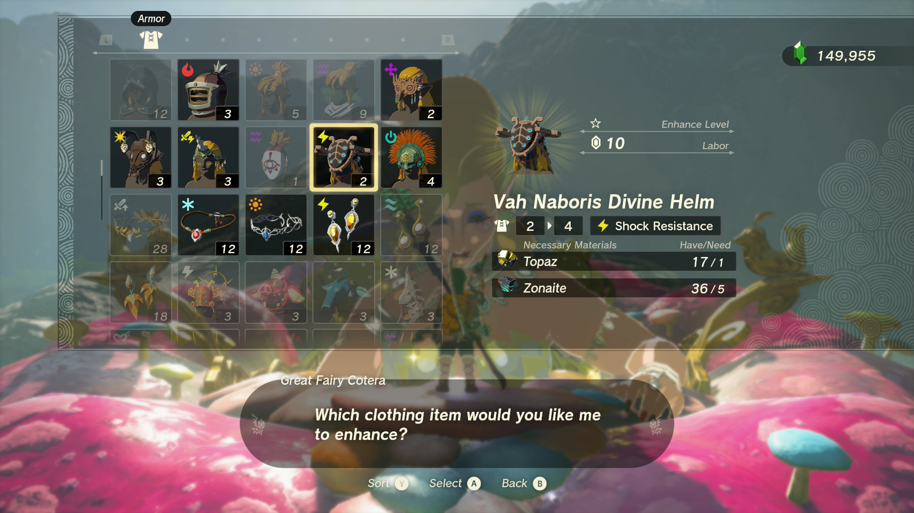

Previously featured in Breath of the Wild as an Amiibo-exclusive item, the Vah Naboris Divine Helm returns in The Legend of Zelda: Tears of the Kingdom, and this time around, the Gerudo headgear can be obtained by anyone that knows where to look. Based on the camel-like Vah Naboris Divine Beast built to fend off Calamity Ganon, this piece of Armor comes equipped with Shock Resistance. 

In this guide, you'll learn everything you need to know about the Vah Naboris Divine Helm, including where to unlock this unique piece of Armor. 

## Vah Naboris Divine Helm

  * **Description:** "_A helm worn by a warrior who protected the Gerudo in a time beyond memory. It's said to deepen the bond with the Gerudo when worn by a Hylian_ ".

Vah Naboris Divine Helm

Defense  
Effect Bonus  
Cost  
Sale Value

2  
1 Shock Resistance  
N/A  
600 Rupees

Vah Naboris Divine Helm

## How to Unlock the Vah Naboris Divine Helm

  * Scan the Urbosa Breath of the Wild Amiibo
  * Find the Vah Naboris Divine Helm in the West Gerudo Underground Ruins

### Scan the Urbosa Breath of the Wild Amiibo

Similar to its predecessor, Tears of the Kingdom allows you to unlock the Vah Naboris Divine Helm by scanning the Urbosa Breath of the Wild Amiibo, but you'll need a bit of luck. After scanning the Urbosa Amiibo, you'll receive Assorted Meat, a Gerudo Scimitar, and _**you'll have a chance to unlock**_ the Vah Naboris Divine Helm. If you scan the Urbosa Amiibo but don't get the Vah Naboris Divine Helm, you'll have three options: 

  * Because Amiibos can only be scanned once per day, you can wait 24 hours, then scan the Urbosa Amiibo again to test your luck.
  * If you save your game before scanning the Urbosa Amiibo, you can reload the save if you scan the Amiibo and do not receive the Vah Naboris Divine Helm.
  * Lastly, scan Urbosa, and if you don't receive the Vah Naboris Divine Helm, save your game and close Tears of the Kingdom. Then access your Switch's System Settings to jump forward a day before opening TotK to scan Urbosa once more.

### Find the Vah Naboris Divine Helm in the West Gerudo Underground Ruins

If you don't have access to Urbosa Amiibo, fear not because the Vah Naboris Divine Helm can also be collected from the West Gerudo Underground Ruins – a secret area found beneath the Gerudo Desert. One of the quickest and safest ways to reach the West Gerudo Underground Ruins is to start from the Gerudo Highlands Skyview Tower. Use the tower to launch yourself into the air, and glide southwest past the Karusa Valley and the Mayamats Shrine. 

Once you've cleared the Gerudo Highlands cliffside and reached the Gerudo Desert, you'll notice a massive skeleton that covers some ruins. At the center of these ruins, you'll find a small fissure. Throw a Bomb Flower or a Zonai Time Bomb into the fissure, then jump into the hole to enter the West Gerudo Underground Ruins. 

After walking down the ramp, you'll find yourself in a room completely surrounded by breakable stone. Use your Weapons to clear a path through the right wall, and you'll soon discover statues pointing southward. 

If you don't have Weapons capable of breaking through the stone, Fuse the rocks in the area with the Rusty Claymores held up by the statues. 

Next, continue carving a path in the direction indicated by the statues, and after clearing the twin pillars pictured above, carve a path to the left to discover a **Bubbulfrog**. 

Defeat the Bubbulfrog to collect a Bubbul Gem, then head southwest, as indicated by the nearby statue. 

When you reach the statue in the southwestern corner, cut through the stone blocking the hallway pictured above. 

At the end of the hall, open the chest on the pedestal to add the **Vah Naboris Divine Helm** to your inventory! To exit the West Gerudo Underground Ruins, you Ascend or use Ultrahand to pull the nearby lever and open the gate back to the starting area. 

## Vah Naboris Divine Helm Upgrades

The Vah Naboris Divine Helm can be upgraded at Great Fairy Fountains, and though it can be dyed at the Hateno Dye Shop, the changes are minimal because _**only the face mask will change colors**_ while the actual headpiece remains the same. To learn more about the Vah Naboris Divine Helm's potential upgrades and stats, check out the table below: 

Vah Naboris Divine Helm Upgrades

Level  
Materials  
Labor Cost  
Defense Level

Base  
N/A  
N/A  
2

★  
1x Topaz5x Zonaite  
10 Rupees  
4

★★  
4x Topaz10x Zonaite  
50 Rupees  
6

★★★  
6x Topaz5x Large Zonaite5x Dazzlefruit  
200 Rupees  
9

★★★★  
10x Topaz10x Large Zonaite10x Dazzlefruit  
500 Rupees  
16

### Up Next: Vah Rudania Divine Helm

Previous

Vah Medoh Divine Helm

Next

Vah Rudania Divine Helm

### Top Guide Sections

  * Walkthrough
  * Zelda: Tears of The Kingdom Switch 2 Edition Guide
  * Zelda Notes Voice Memories
  * List of Side Quests and Side Adventures

### Was this guide helpful?

Leave feedback

Go to comments