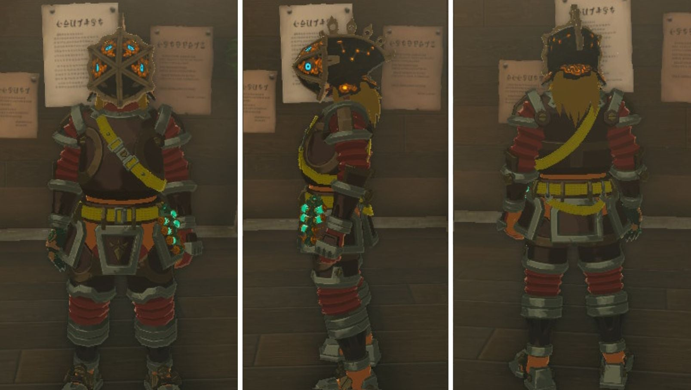
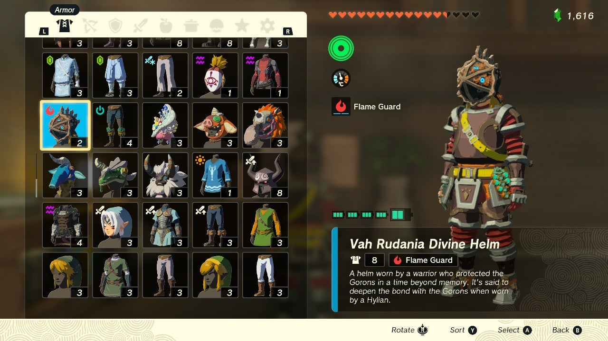
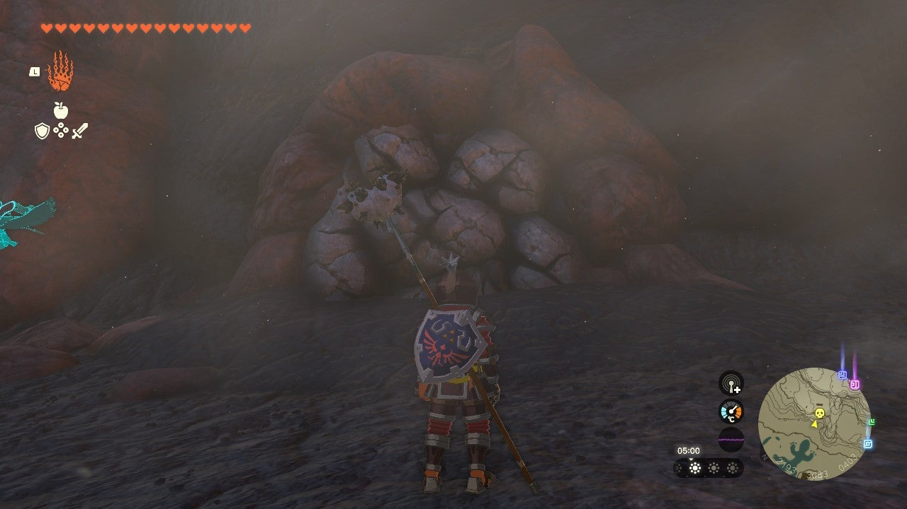
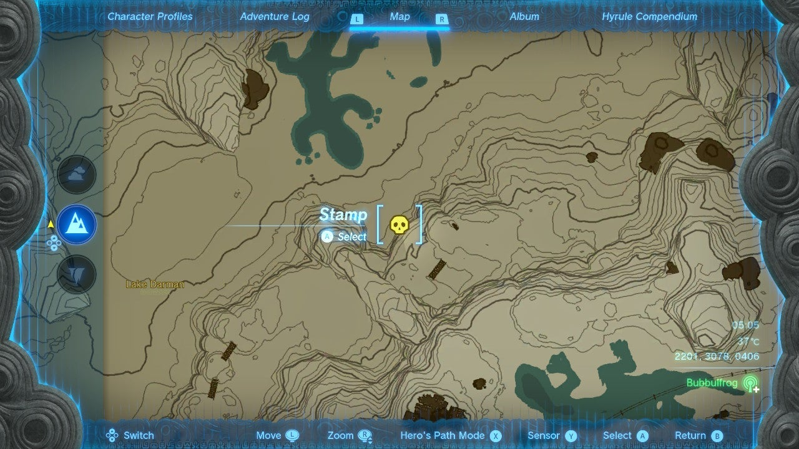
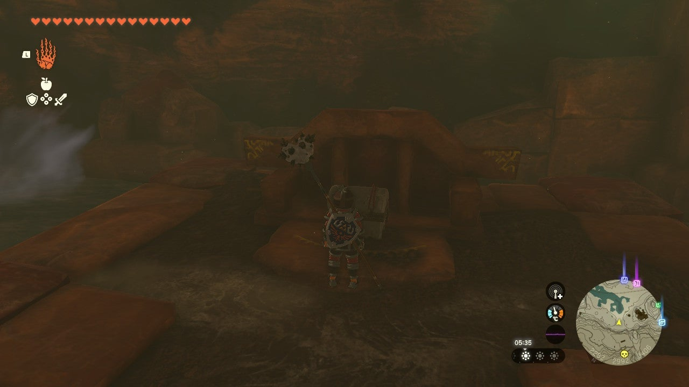

The **Vah Rudania Divine Helm** is an armor piece in The Legend of Zelda: Tears of the Kingdom. If you’re a fan of the Legend of Zelda franchise and have played Breath of the Wild before, you will most likely recognize this legendary piece of gear. 

The **Vah Rudania Divine Helm** is based on the Divine Beast that was piloted by the Champion Daruk in BoTW. You can get your hands on this mythical helmet by scanning the Champion Daruk Amiibo, but it is also hidden deep within the Eldin region for anyone willing to find it. 

In this Tears of the Kingdom guide, we will teach you everything you need to know about the Vah Rudania Divine Helm, including all of its stats and where to find it. 

## Vah Rudania Divine Helm

**Official Description** : A helm worn by a warrior who protected the Gorons in a time beyond memory. It’s said to deepen the bond with the Gorons when worn by a Hylian. 

The Vah Rudania Divine Helm can be dyed at the Hateno Dye Shop and upgraded at the Great Fairy Fountain.

Vah Rudania Divine Helm

Defense  
Effect Bonus  
Cost  
Sale Value

2  
Flame GuardStrengthens Yunobo’s Spirit  
N/A  
600 Rupees

Vah Rudania Divine Helm

## How to Get the Vah Rudania Divine Helm in The Legend of Zelda: Tears of the Kingdom

You can either get the Vah Rudania Divine Helm by scanning an Amiibo or finding it the old-fashioned way. 

### Scan Your Champion Daruk Amiibo

If you have the **Champion Daruk Amiibo** , you’re in luck. The legendary mask is a random drop for that Amiibo, so the Vah Rudania Divine Helm could be just a scan away if you’re lucky. You might not get it first try, however, and you can only scan your Amiibo once per day, so you may want to save your game before you scan. That way, if you don’t get it, you can simply reload and try again. 

## Find the Vah Rudania Divine Helm in the Eldin Region

If you don’t have the Champion Daruk Amiibo, don’t worry, all is not lost, and you can still get your hands on the Vah Rudania Divine Helm. The Helm is hidden in a cave in the Eldin region, waiting for someone like you to find it. 

The Vah Rudania Divine Helm can be found at any time. No story progression is required.

If you’ve spent much time perusing the Eldin map in The Legend of Zelda: Tears of the Kingdom, you may have noticed **two lizard-shaped ponds** North of Death Mountain. Both of these lizards are facing the Vah Rudania Divine Helm. 

Make your way to the location of the lizards by heading to the Marakuguc Shrine and hitching a ride North on the Minecarts, or by fast-traveling to the Sibajitak Shrine and making your way Southwest. 

Nestled in a rock face, right in between the two lizards, is a breakable rock wall. Smash it to find yourself in the **Lizard’s Burrow** Cave. 

Its exact coordinates are 2193, 3083, 0403. 

The Vah Rudania Divine Helm is resting in a chest at the back of the cave. The exact coordinates of the treasure are 2282, 2992, 0406. 

## Vah Rudania Divine Helm Upgrade Requirements

Level  
Materials  
Defense Level (Total)

Base  
N/A  
2

★  
10 Rupees5x Zonaite1x Ruby  
4

★★  
50 Rupees10x Zonaite4x Ruby  
6

★★★  
200 Rupees6x Ruby  
9

★★★★  
500 Rupees10x Ruby10x Large Zonaite  
16

### Up Next: Vah Ruta Divine Helm

Previous

Vah Naboris Divine Helm

Next

Vah Ruta Divine Helm

### Top Guide Sections

  * Walkthrough
  * Zelda: Tears of The Kingdom Switch 2 Edition Guide
  * Zelda Notes Voice Memories
  * List of Side Quests and Side Adventures

### Was this guide helpful?

Leave feedback

### In This Guide

The Legend of Zelda: Tears of the KingdomNintendo EPD

Initial Release: May 12, 2023

Learn more

Go to comments