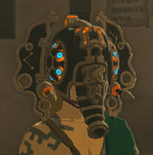
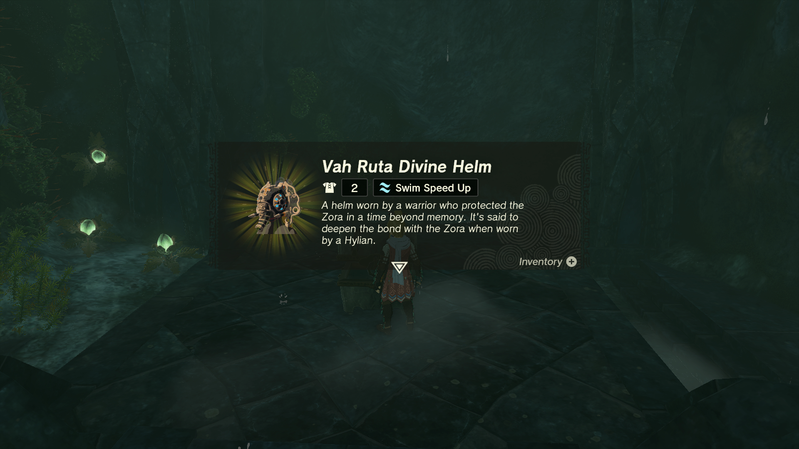
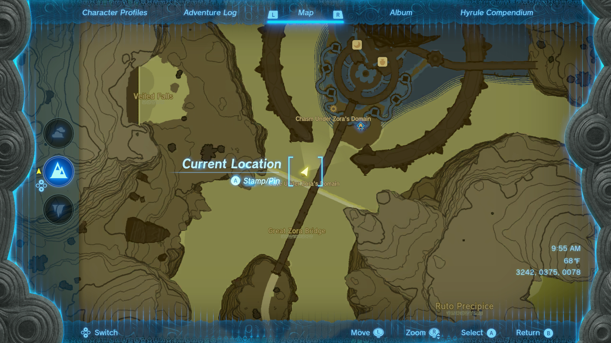
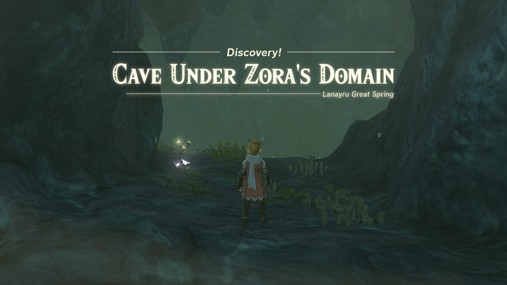
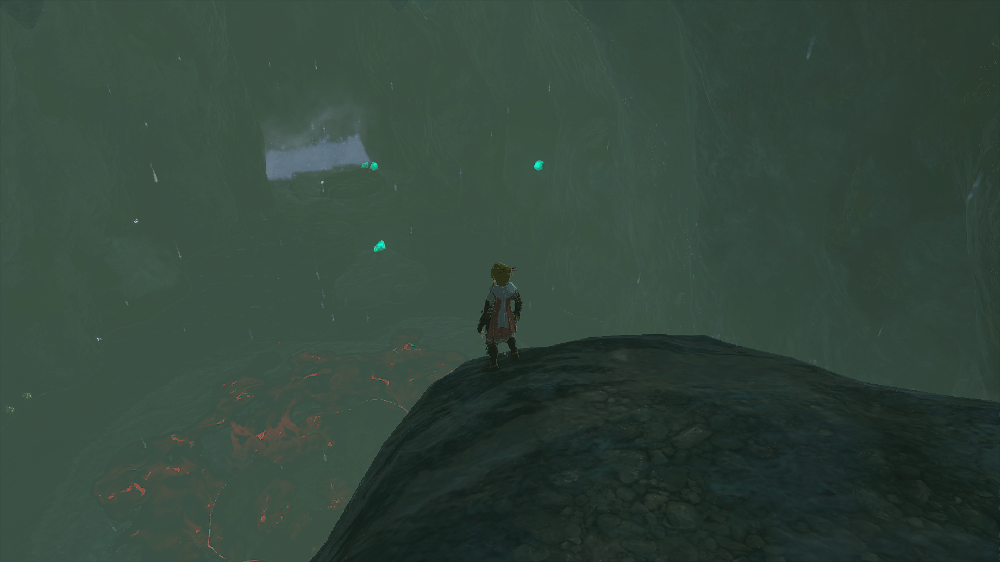
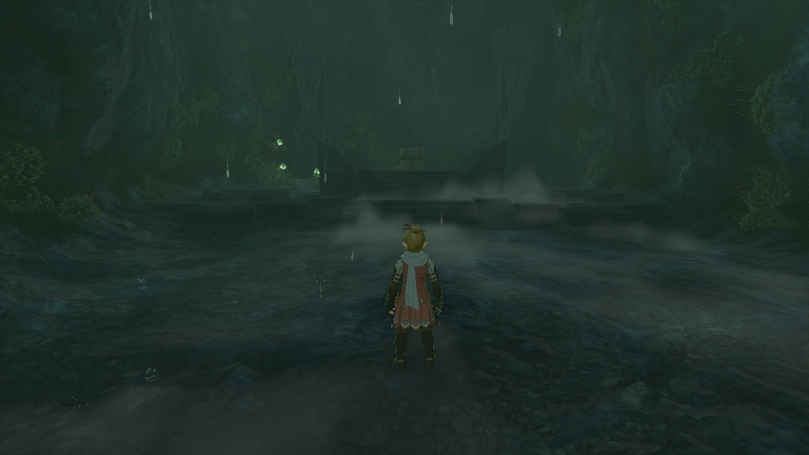
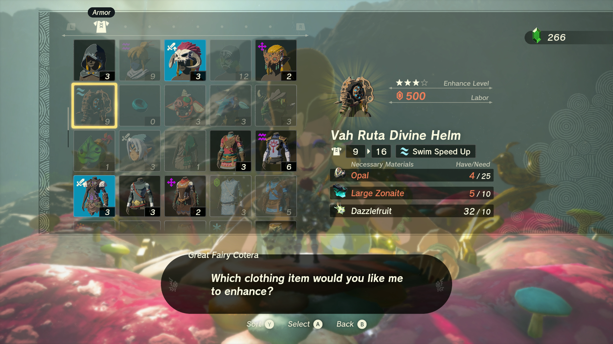

The Vah Ruta Diving Helm modeled after the Zora's Divine Beast in The Legend of Zelda: Tears of the Kingdom grants the wearer a speed boost in the water. The location of this piece of Armor is revealed by the side quest Secret Treasure Under the Great Fish but can be found without starting it. 

In this Tears of the Kingdom guide, you'll learn how to unlock the Vah Ruta Divine Helm and get details on this item's stats. 

## Vah Ruta Divine Helm

  * **Description:** _"A helm worn by a warrior who protected the Zora in a time beyond memory. It's said to deepen the bond with the Zora when worn by a Hylian._ "

Vah Ruta Divine Helm Base Stats

Defense  
Effect Bonus  
Cost  
Sale Value

2  
Swim Speed Up  
N/A  
600

Vah Ruta Divine Helm

The Stealth Armor Set can be dyed at the Hateno Dye shop and upgraded at the Great Fairy Fountains. 

## Where to find the Vah Ruta Divine Helm

The side quest Secret Treasure Under the Great Fish provides hints on the location of the Helm though it is not necessary and there is no required story progression to find this headgear. 

Behind the large waterfall under the Great Zora Bridge, you can find the aptly named Cave Under Zora's Domain. 

  * **Cave Under Zora's Domain Coordinates:** 3242, 0375, 0078

There is a large cavern with the entrance to the Chasm Under Zora's Domain and a waterfall directly opposite where you come in. 

Make your way to the waterfall and behind is a smaller cave containing the chest. 

## Vah Ruta Divine Helm Upgrades

The Vah Ruta Divine Helm can be upgraded at the Great Fairy Fountains once unlocked. It can also be dyed at the Hateno Dye shop though **only the chin strap will change**. 

Level  
Materials  
Defense Level

Base  
2

★  
10 Rupees(5) Opal(5) Zonaite  
4

★★  
50 Rupees(10) Opal(10) Zonaite  
6

★★★  
200 Rupees(15) Opal(5) Large Zonaite(5) Dazzlefruit  
9

★★★★  
500 Rupees(25) Opal(10) Large Zonaite(10) Dazzlefruit  
16

### Up Next: Well Worn Hair Band

Previous

Vah Rudania Divine Helm

Next

Well Worn Hair Band

### Top Guide Sections

  * Walkthrough
  * Zelda: Tears of The Kingdom Switch 2 Edition Guide
  * Zelda Notes Voice Memories
  * List of Side Quests and Side Adventures

### Was this guide helpful?

Leave feedback

Go to comments