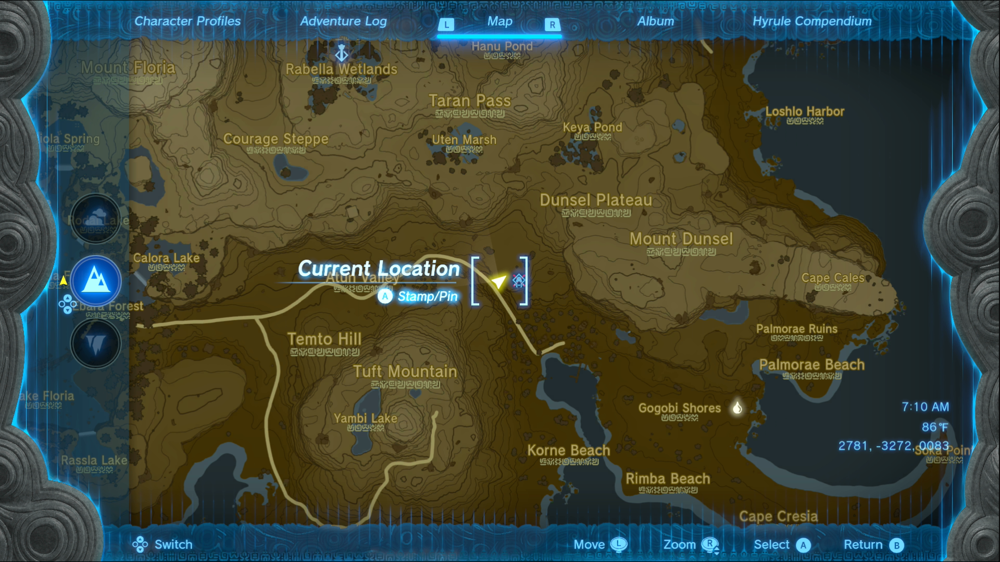

The Village Attacked by Pirates side quest is a related quest to the Ruffian-Infested Village side adventure in Zelda: Tears of the Kingdom. Note that you don't need to activate this quest to pursue the side adventure. 

  * **Side Quest Location:** Lookout Landing, General Store
  * **Prerequisites:** Complete **Regional Phenonema**
  * **Rewards:** Mighty Salt-Grilled Crab

Head to the General Store in Lookout Landing and you will spot the two villagers Garini and Mubs talking. If you speak to Garini, he will tell you that he has heard of his home village being attacked by pirates. 

Garini will provide a hint to the existence of the Ruffian-Infested Village side adventure, asking you to track down Rozel, the village chief. 

If you've already unlocked it, fast-travel to Sifumim Shrine and look for Rozel nearby. Rozel will tell you all about the quest and ask you for help. Complete Ruffian-Infested Village. 

After you're done, remember to talk to Garini again and turn in the quest. You will receive thanks and a free Mighty Salt-Grilled Crab meal. 

Village Attacked by Pirates

See the complete List of Side Quests and Side Adventures

### Up Next: Walkthrough

Previous

About IGN's Zelda TotK Guide Writers

Next

Walkthrough

### Top Guide Sections

  * Walkthrough
  * Zelda: Tears of The Kingdom Switch 2 Edition Guide
  * Zelda Notes Voice Memories
  * List of Side Quests and Side Adventures

### Was this guide helpful?

Leave feedback

Go to comments