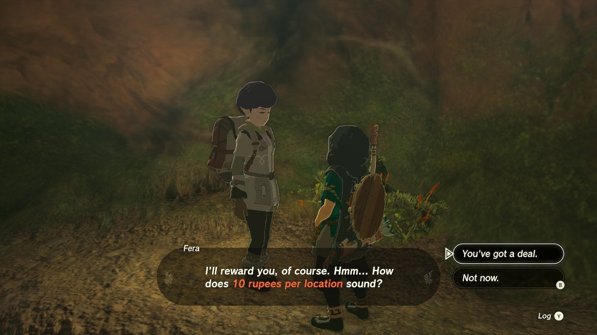
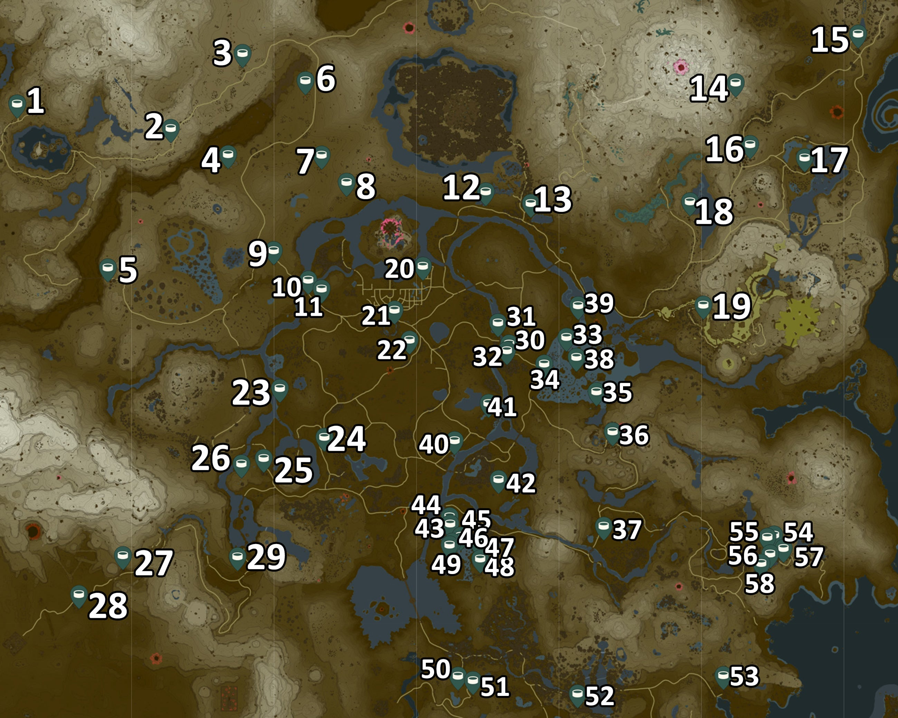

The Where Are the Wells side quest is easy to miss, as the starting point is hidden below ground. Inside one of Hyrule's many wells, to be exact. If you're ready to go on a well-hunting quest, here's how to complete **Where Are the Wells?** in Tears of the Kingdom. We have updated our checklist and map in 2024 to ensure the smoothest and most reliable tracking experience. This guide has been tested by IGN and confirmed to work for all versions of TOTK, including the Tears of the Kingdom Switch 2 Edition released in 2025. 

To start the Where Are the Wells quest, you need to find an NPC called **Fera**. She may be found in different well locations, but seems to be especially fond of those near stables. For example, you can find Fera inside the South Akkala Stable Well or the Wetland Stable Well. 

Once you've found her, Fera will inform you of her love for damp and dark places. She'll tell you that there are **58 wells across Hyrule** , and she's willing to pay **10 rupees** for each well location you find. In other words, the reward for this side quest is 580 rupees if you manage to find every well. 

To officially "discover" a well, you simply need to get close enough. There's no need to go down the wells - if its location appears on your map, the well will count towards the total. Return to Fera and speak to her again to collect rupees for the wells you've discovered so far. 

Where Are the Wells?

See the complete List of Side Quests and Side Adventures

Don't forget to snap a picture of a Well for your **Hyrule Compendium**! 

509 Well

## TotK Well Locations Map

To find **all 58 well locations** , you might want to use our Legend of Zelda: Tears of the Kingdom interactive map and select all the well locations as shown below. 

Go To Map

All Tears of the Kingdom Well Locations Map

Alternatively, you can use this static, numbered map to track them down and check them off via our checklist markers below. When in doubt, you can use the checklist navigation (down arrow next to each checklist marker below) to instantly jump to the map location, too. 

  
To keep track of all the wells you've discovered so far, here's a checklist: 

1\. Dronoc's Pass Well

2\. Tabantha Village Ruins Well

3\. Snowfield Stable Well

4\. Maritta Exchange Ruins Well

5\. Tabantha Bridge Stable Well

6\. Rowan Plain Well

7\. Irch Plain Well

8\. Elma Knolls Well

9\. New Serenne Stable Well

10\. Carok Bridge Well

11\. Mount Gustaf Well

12\. Rauru Settlement Ruins Well

13\. Woodland Stable Well

14\. Shadow Hamlet Ruins Well

15\. East Akkala Stable Well

16\. South Akkala Stable Well

17\. Construction Site Well

18\. Foothill Stable Well

19\. Tabahl Woods Well

20\. Hyrule Castle Town Ruins Well

21\. Lookout Landing Well

22\. Mabe Village Ruins Well

23\. Mount Daphnes Well

24\. Aquame Lake Well

25\. Outskirt Stable Well

26\. Outskirt Hill Well

27\. Gerudo Canyon Well

28\. Kara Kara Bazaar Well

29\. Mount Nabooru Well

30\. Wetland Stable Well

31\. Rebonae Bridge Well

32\. Wetland Stable South Well

33\. Zauz Island Well

34\. Lanayru Wetlands Well

35\. Rikoka Hills Well

36\. Kakariko Village Well

37\. Dueling Peaks Stable Well

38\. Goponga Village Ruins Well

39\. Moor Garrison Ruins Well

40\. Riverside Stable Well

41\. Bottomless Pond Well

42\. South Nabi Lake Well

43\. Deya Village Ruins Well

44\. Deya Village Ruins North Well

45\. Deya Village Ruins East Well

46\. Deya Village Ruins South Well

47\. Popla Foothills North Well

48\. Popla Foothills South Well

49\. Hills of Baumer Well

50\. Haran Lakefront Well

51\. Highland Stable Well

52\. Lakeside Stable Well

53\. Lurelin Village Well

54\. Hateno Village North Well

55\. Hateno Village West Well

56\. Hateno Village South Well

57\. Hateno Village East Well

58\. Zelda’s Secret Well

### Up Next: Walkthrough

Previous

About IGN's Zelda TotK Guide Writers

Next

Walkthrough

### Top Guide Sections

  * Walkthrough
  * Zelda: Tears of The Kingdom Switch 2 Edition Guide
  * Zelda Notes Voice Memories
  * List of Side Quests and Side Adventures

### Was this guide helpful?

Leave feedback

### In This Guide

The Legend of Zelda: Tears of the KingdomNintendo EPD

Initial Release: May 12, 2023

Learn more

Go to comments