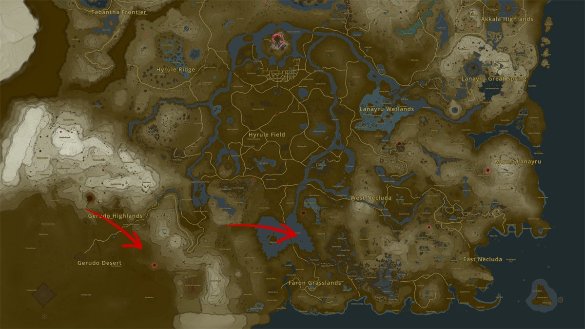
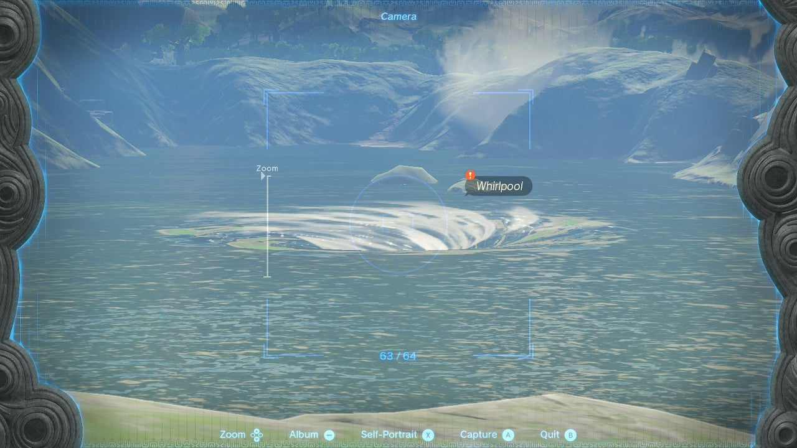

One of Link's new Korok friends in the Lost Woods is dying to see a mysterious "swirly circle". Luckily, we can help the little Korok by taking a picture of this strange natural phenomenon. Here's how to find the swirly circle in the Tears of the Kingdom side quest **Whirly Swirly Things**. 

## Whirly Swirly Things Walkthrough

To start this side quest, speak to the Korok named **Kula**. You'll find this Korok right next to the Musanokir Shrine in the middle of the Lost Woods, the Great Hyrule Forest region, at coordinates 0420, 2130, 0143. Kula will inform you about the "whirly, swirly circle" he wants to see, but his directions are very vague. 

For the first Whirly Swirly Things location, go to the Faron region in the southern part of Hyrule (see location map below, right arrow). Approach **Lake Hylia** , the eastern side, and take a picture of the large whirlpool in the water. You can do so from any direction, even a nearby sky island, as long as the whirlpool is clearly visible. 

Return to Kula and show him the picture to complete the first part of Whirly Swirly Things. Next, he wants to see a "big swirly sand circle", which means we're headed to the Gerudo Desert. The whirlpool is found at the East Gerudo Ruins, which is east of Gerudo Town and south of the Gerudo Canyon Skyview Tower (red arrow on the left side). 

Return to Kula to complete the Whirly Swirly Things side quest. Kula will reward you with **five Endura Carrots**. 

Whirly Swirly Things

See the complete List of Side Quests and Side Adventures

### Up Next: Walkthrough

Previous

About IGN's Zelda TotK Guide Writers

Next

Walkthrough

### Top Guide Sections

  * Walkthrough
  * Zelda: Tears of The Kingdom Switch 2 Edition Guide
  * Zelda Notes Voice Memories
  * List of Side Quests and Side Adventures

### Was this guide helpful?

Leave feedback

### In This Guide

The Legend of Zelda: Tears of the KingdomNintendo EPD

Initial Release: May 12, 2023

Learn more

Go to comments