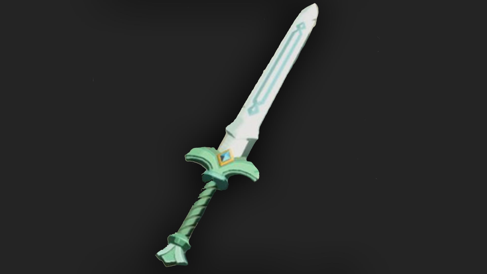

The White Sword of the Sky is a one-handed weapon in The Legend of Zelda: Tears of the Kingdom. While you'll need to do a bit of leg work to get this sword, it surely stands out from the other weapons in the game with its beautiful white blade and the heavenly breeze it produces. 

## White Sword of the Sky Stats

A sword said to have once belonged to a hero from the sky. Its beautiful white blade stands out. When it's wielded, a strange yet heavenly breeze kicks up around you. 

  * **Hyrule Compendium number:** 359
  * **Base Damage:** 24
  * **Passive Ability:** Improvised Sneakstrike

359 White Sword of the Sky

You'll get this weapon by completing "The Mother Goddess Statue" side quest. 

Learn more about The Legend of Zelda: Tears of the Kingdom with our helpful guide: 

  * Complete Walkthrough
  * Tips, Tricks, and Things to Know
  * Things to Do First in TotK

Or Jump back to our Weapons Hub

### Up Next: Walkthrough

Previous

About IGN's Zelda TotK Guide Writers

Next

Walkthrough

### Top Guide Sections

  * Walkthrough
  * Zelda: Tears of The Kingdom Switch 2 Edition Guide
  * Zelda Notes Voice Memories
  * List of Side Quests and Side Adventures

### Was this guide helpful?

Leave feedback

### In This Guide

The Legend of Zelda: Tears of the KingdomNintendo EPD

Initial Release: May 12, 2023

Learn more

Go to comments