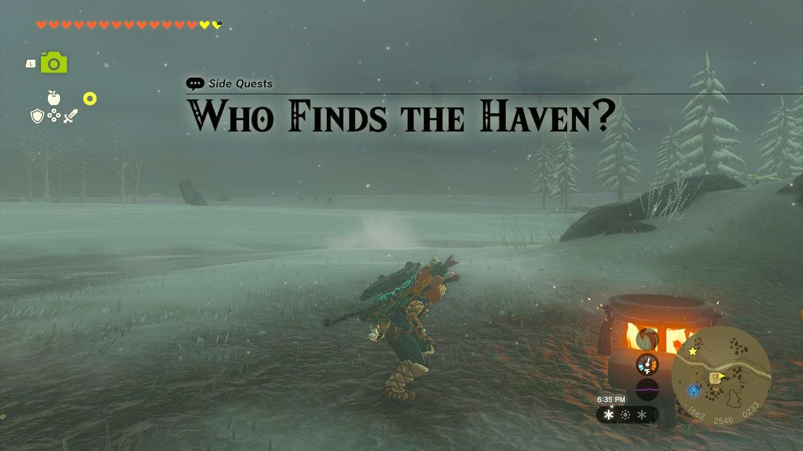
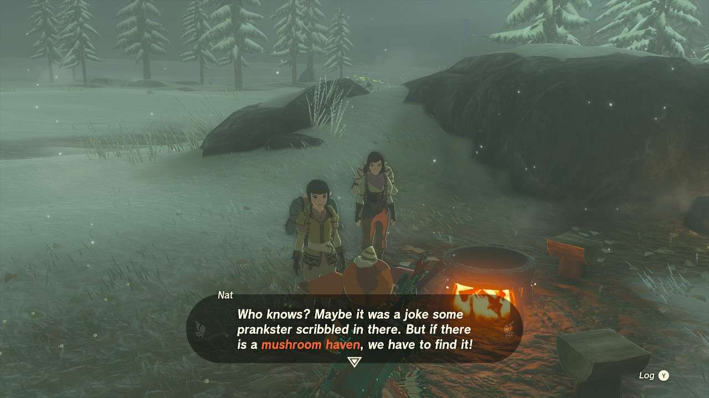
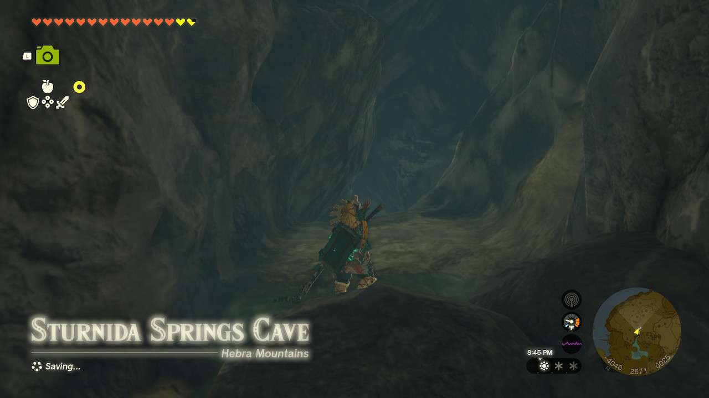
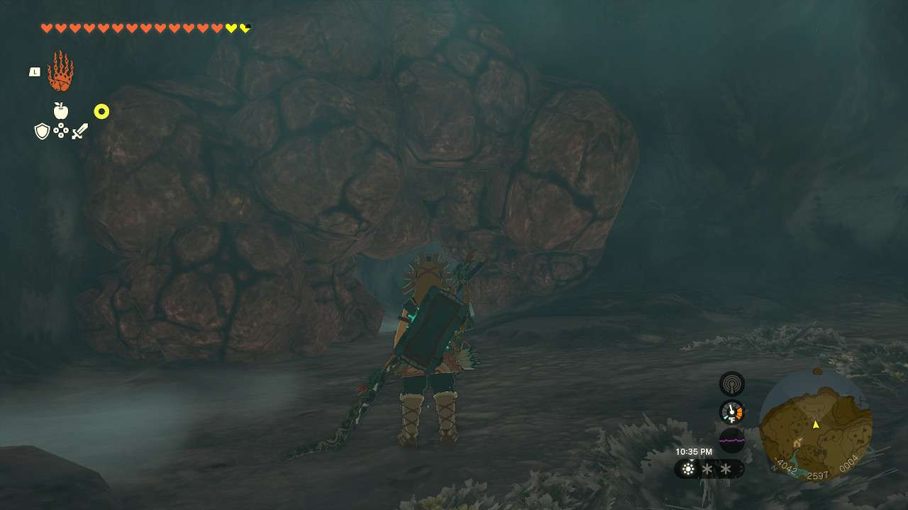
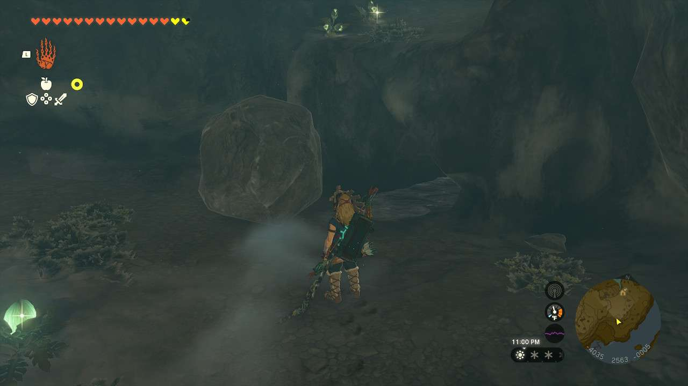
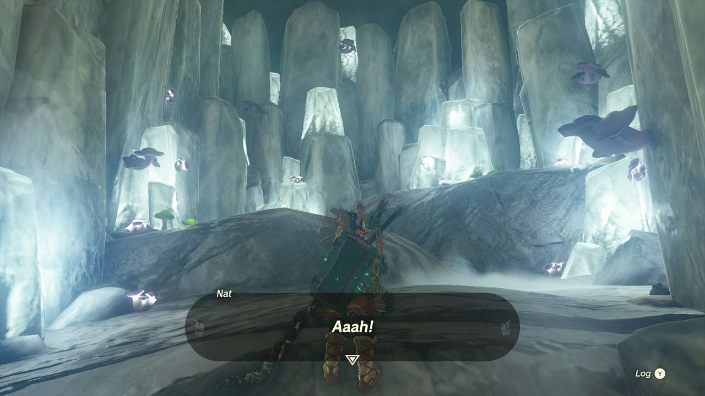

**Who Finds the Haven** is one of the many Side Quests to complete in The Legend of Zelda: Tears of the Kingdom. In this guide, we will teach you everything you need to know to complete Who Finds the Haven, including where to find it and what you will get as a reward. 

  * **Side Quest Location** : Snowfield Stable, Tabantha Tundra
  * **Prerequisites** : Complete Cave Mushrooms That Glow and The Captured Tent
  * **Rewards** : n/a (Technically a treasure trove of mushrooms and truffles)

Immediately following the events of The Captured Tent, **Nat and Meghyn** will let you in on their secret quest of trying to find a haven of mushrooms. They’re going by a journal entry they found that reads _“Vapors drift over Sturnida Basin, near a pond in Hebra. At the source of the Steam lies a bright mushroom haven.”_ You can find it first yourself if you put all the pieces together. 

You’ll need to head to **Sturnida Secret Hot Spring** in the **Sturnida Basin** in the western Hebra Mountains. Follow the source of the spring to the **Sturnida Springs Cave** (-436, 2664, 0024), where you’ll see the two mushroom hunters sure they’ve found the location, but need to go further in. 

If you follow them further in, about halfway down you’ll see a wall of rocks on your left. Destroy these and head inside. 

You’ll find another room with two more areas to break rocks, but what you want to do is turn around and move the boulder that you likely slipped down upon entering into the room. Crouch and walk through this tunnel. 

At the end of it, you’ll find the ‘bright mushroom haven’ first, much to the disappointment of the sisters. They’re good sports about it, though, leaving you free access to everything in the room. There are several different types of mushrooms in this area, as well as several Hearty Truffles and Big Hearty Truffles. Finding the room ends the side quest. 

Who Finds the Haven

See the complete List of Side Quests and Side Adventures

### Up Next: Walkthrough

Previous

About IGN's Zelda TotK Guide Writers

Next

Walkthrough

### Top Guide Sections

  * Walkthrough
  * Zelda: Tears of The Kingdom Switch 2 Edition Guide
  * Zelda Notes Voice Memories
  * List of Side Quests and Side Adventures

### Was this guide helpful?

Leave feedback

Go to comments