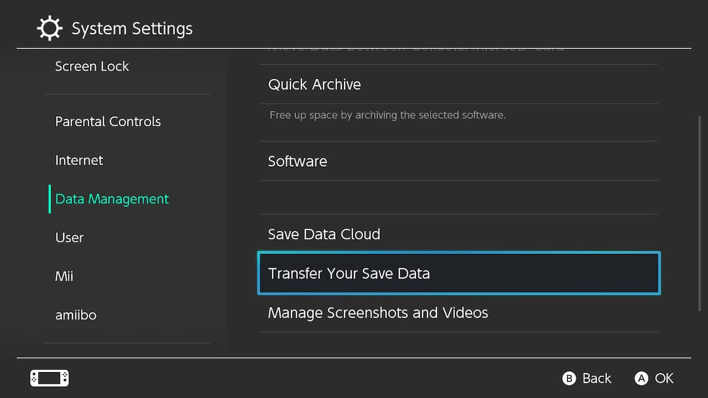
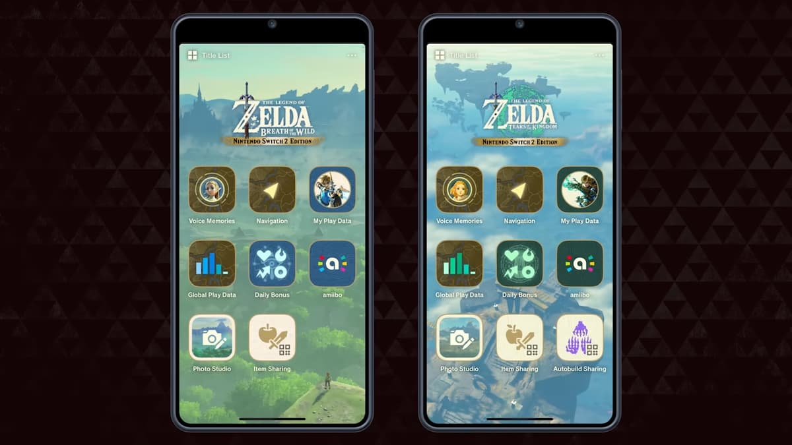
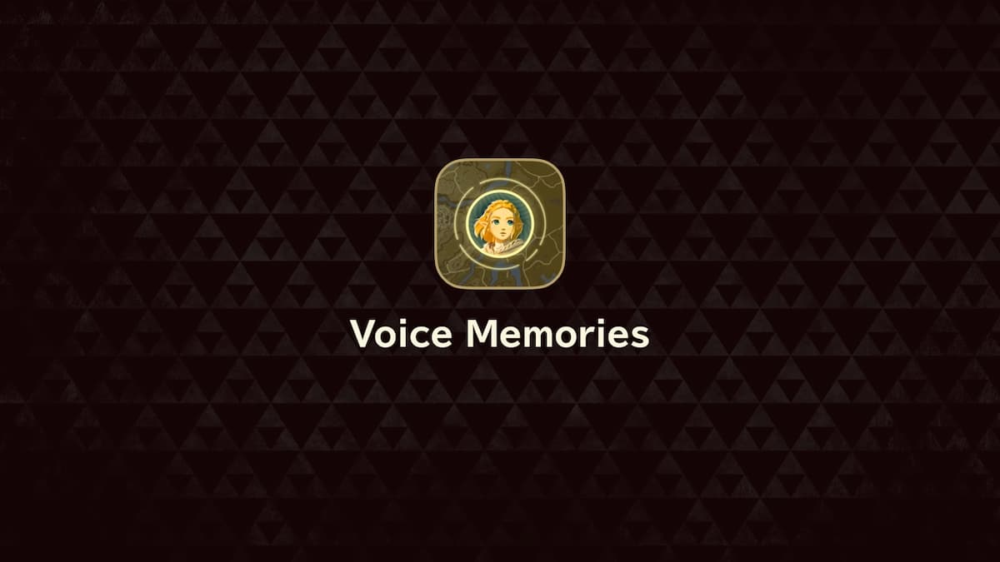

The Legend of Zelda: Tears of the Kingdom launched on June 5th, 2025 for Nintendo Switch 2, allowing you to experience a fantastic adventure as you explore Hyrule as the monumental hero, Link. There are a handful of changes you can expect to find throughout your time playing TotK on your Switch 2, and some things you'll want to know before you dive into the experience. We have you covered on every topic for this upgraded TOTK, preparing you for your adventure to save Princess Zelda. Here's everything you need to know about The Legend of Zelda: TotK release for the Nintendo Switch 2. 

  * Everything New in TotK Switch 2
  * How to Upgrade Totk to the Switch 2 Edition
  * How to Transfer Your Data to TotK Switch 2 Edition
  * How to Set up TotK For Your Switch 2
  * Best Autobuild Sharing QR Codes
  * All Zelda Notes Medals List
  * All Voice Memories
  * How-to Guides

## Everything New in TotK Switch 2

Multiple new features are available for those who purchase the TotK version for the Nintendo Switch 2. If you're curious about each one and how they work, we have a complete breakdown on Everything New in TotK for Switch 2. We'll be covering the graphical upgrades, how to access the upcoming Nintendo Switch App smartphone features, and much more. 

## How to Upgrade Totk to the Switch 2 Edition

You won't have to purchase an entirely new copy of TotK if you already have a copy from when you were playing it on your Switch 1. On this page, we'll cover the necessary steps you need to follow if you're interested in upgrading. The upgrade is not free. It will cost $10 for anyone who already owns the game, unless you have a Nintendo Switch Online subscription, in which case it will be free. 

You **must** purchase the TotK Switch 2 Edition upgrade pack if you want to play TotK on your new Nintendo Switch 2. Unfortunately, there's no getting around this.

## How to Transfer Your Data to TotK Switch 2 Edition

When you purchase Zelda: Tears of the Kingdom for your Nintendo Switch 2, it's possible to transfer all your save data from your Switch 1. This way, you can continue immediately where you left off, as if you were playing from your Nintendo Switch 2 from the beginning. We have a detailed breakdown of the process for transferring your save data on this page, ensuring a seamless transition between consoles. 

You can do this for many of your Switch 1 games that you plan to continue playing on your Nintendo Switch 2, with a more detailed breakdown of those processes available on IGN's Nintendo Switch 2 guide. 

## How to Set Up TotK For Your Switch 2

With your save data transferred over and your upgrade purchased, there are a few other things you'll want to do before you set off in Hyrule and begin your adventure. Check out our dedicated TotK Switch 2 Setup guide that breaks down everything you'll want to do on your Switch 2, including adjusting your graphics to get the best performance from TotK while playing on your new console. 

## Best Autobuild Sharing QR Codes

There's an added Autobuild feature coming to Zelda Notes, a feature included for the TotK Switch 2 version that you can access through the Nintendo Switch App from your smartphone. Here, much like item sharing, you can share your Autobuild designs with other players by sharing QR codes. 

We'll be cultivating some of the best designs from players who are publicly sharing these. If you're looking for inspiration for your next design or want to add something new to your game, be sure to head over to this page to check out those QR codes. 

## All Zelda Notes Medals List

The Zelda Notes feature also comes with a list of milestones and achievements you can unlock during your adventure in TotK. The smartphone application keeps track of everything you do in the game, cataloging how many enemies you defeat and how many times you receive the game over screen. 

We have a dedicated page listing out all the various medals and achievements you can unlock while playing TotK on the Nintendo Switch 2. Head on over there to learn what medals you're missing and what steps you'll have to take to unlock them. There's always more to explore in Hyrule. 

## All Voice Memories

As you explore Hyrule and visit specific locations, there are Voice Memories you can unlock. The Voice Memories are available in your Zelda Notes from your smartphone. You can play them from your phone while you're at that location in TotK, and listen to Princess Zelda and other notable characters tell you about their experiences and history from that location. 

We have a 100% Voice Memories Locations where you can find these unique audio files and learn about them once you arrive. Head over there to make sure you collect each other during your adventure, and learn more about the fantastic world of Hyrule. 

## How-to Guides

Although much of TotK is the same between the Switch 1 and the Switch 2, there are a handful of differences that you might want to know while you're playing. We have a handful of guides you can check out that provide more details about these differences, alongside the existing how-to guides we've written for TotK. 

  * How to Connect Your Switch 2 to Zelda Notes
  * How to Use Zelda Notes for Tears of the Kingdom
  * How to Turn Off Voice Navigation in Zelda Notes
  * How to Use Amiibo with Zelda Notes
  * How to use Zelda Notes Daily Bonus in Tears of the Kingdom
  * How to Use Autobuild Sharing
  * How to Share Items with Friends
  * Where to Find My Play Data
  * Best Autobuild Sharing QR Codes

**For more The Legend of Zelda: Tears of the Kingdom on the Switch 2, check out:**

  * How to Use Autobuild Sharing
  * Zelda Notes Voice Memories
  * Everything New in Zelda: Tears of the Kingdom Switch 2

### Up Next: Best Autobuild Sharing QR Codes

Previous

How to Beat Ganondorf

Next

Best Autobuild Sharing QR Codes

### Top Guide Sections

  * Walkthrough
  * Zelda: Tears of The Kingdom Switch 2 Edition Guide
  * Zelda Notes Voice Memories
  * List of Side Quests and Side Adventures

### Was this guide helpful?

Leave feedback

### In This Guide

The Legend of Zelda: Tears of the KingdomNintendo EPD

Initial Release: May 12, 2023

Learn more

Go to comments