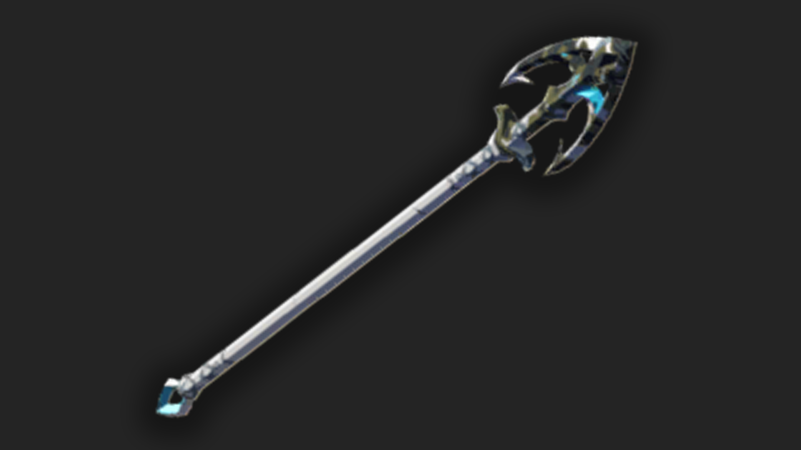

The Zora Spear is a spear in The Legend of Zelda: Tears of the Kingdom. The Zora made this spear with a special material that increases the weapon's attack power whenever you get it wet. 

## Zora Spear Stats

 _"A Zora spear with a decayed point. It’s made of a water-resistant metal and yields a high attack power when it gets wet."_

  * **Hyrule Compendium number:** 422
  * **Base Damage:** 6
  * **Passive Ability** : Water Warrior

422 Zora Spear

## Where to Find a Zora Spear

The Zora Spear weapon can generally be found in the Lanayru Wetlands and in Upland Zorana. 

You will need a Zora Spear in order to complete the Glory of the Zora Side Quest in Zora's Domain. 

If you complete the Mired in Muck quest, Bazz will give you a Zora Spear as a reward. If you haven’t held onto the Zora Spear reward (or if you broke it... whoops), you may find one in the Tabahl Woods Cave, southwest of Zora’s Domain, or with the Lizalfos outside of the cave. Look for it along the path that leads from Lanayru Wetlands into Zora's Domain. 

Go To Map

Hyrule Map

Learn more about The Legend of Zelda: Tears of the Kingdom with our helpful guide: 

  * Complete Walkthrough
  * Tips, Tricks, and Things to Know
  * Things to Do First in TotK

Or Jump back to our Weapons Hub

### Up Next: Walkthrough

Previous

About IGN's Zelda TotK Guide Writers

Next

Walkthrough

### Top Guide Sections

  * Walkthrough
  * Zelda: Tears of The Kingdom Switch 2 Edition Guide
  * Zelda Notes Voice Memories
  * List of Side Quests and Side Adventures

### Was this guide helpful?

Leave feedback

Go to comments