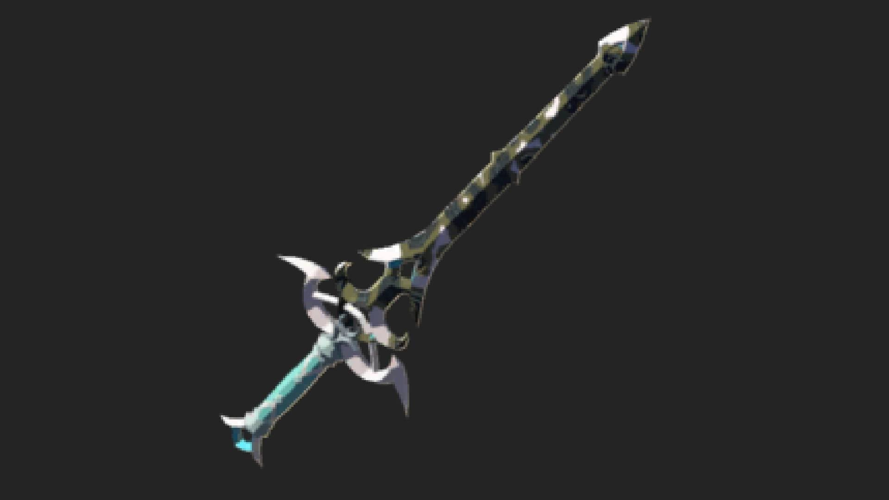

The Zora Sword is a single-handed weapon in The Legend of Zelda: Tears of the Kingdom. Like most Zora weapons, you can expect this one to deal more damage when it gets wet. 

## Zora Sword Stats

A long Zora sword with a decaying blade. Made of a metal favored by the Zora, it yields a high attack power when it gets wet.

  * **Hyrule Compendium number:** 346
  * **Base Damage:** 6
  * **Weapon Modifier:** Water Warrior

346 Zora Sword

You will usually find this sword when exploring the Lanayru Great Spring. 

Learn more about The Legend of Zelda: Tears of the Kingdom with our helpful guide: 

  * Complete Walkthrough
  * Tips, Tricks, and Things to Know
  * Things to Do First in TotK

Or Jump back to our Weapons Hub

### Up Next: Walkthrough

Previous

About IGN's Zelda TotK Guide Writers

Next

Walkthrough

### Top Guide Sections

  * Walkthrough
  * Zelda: Tears of The Kingdom Switch 2 Edition Guide
  * Zelda Notes Voice Memories
  * List of Side Quests and Side Adventures

### Was this guide helpful?

Leave feedback

### In This Guide

The Legend of Zelda: Tears of the KingdomNintendo EPD

Initial Release: May 12, 2023

Learn more

Go to comments